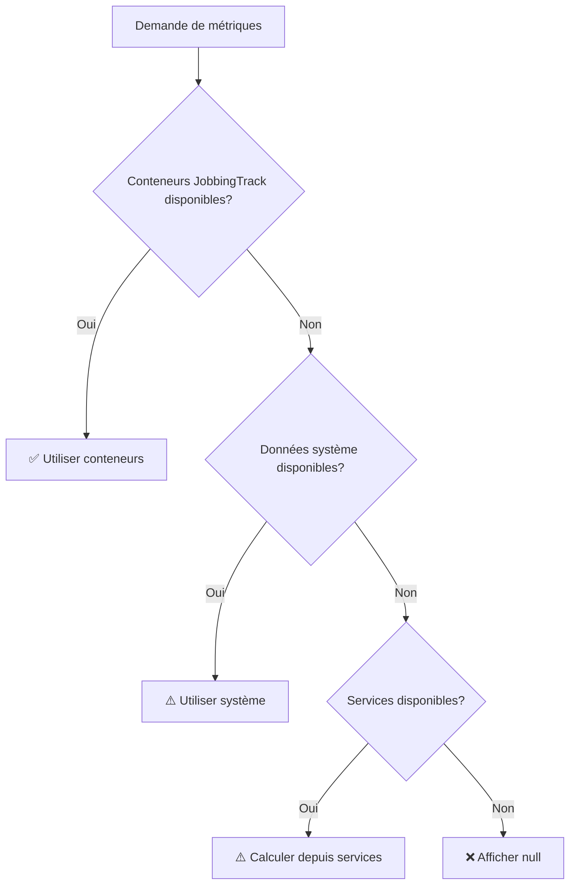

# Correction : Cohérence des Métriques entre Pages

**Date:** 2025-11-03  
**Branche:** tech/monitoring-system  
**Fichier modifié:** `frontend/src/app/(admin)/backoffice/analytics/page.tsx`

## 🎯 Problème Identifié

### Incohérence entre les Pages

**Vue d'ensemble** affichait : `CPU Moyen: 65.7%`  
**Analytics (Synthèse)** affichait : `CPU Moyen: 6%` puis `3%`

### Cause Racine

Les deux pages utilisaient des **sources de données différentes** :

#### Vue d'ensemble (`/backoffice/page.tsx`)
```typescript
// ✅ Source fiable : Données conteneurs JobbingTrack
systemMetrics.jobbingtrack.containers.cpu.averagePercent
systemMetrics.jobbingtrack.containers.memory.used
```

#### Analytics AVANT la correction (`/analytics/page.tsx`)
```typescript
// ❌ Source incorrecte : Données système globales ou moyenne calculée
metrics.system.cpu.usage  // Souvent indisponible ou incorrecte
// OU
moyenne des services (calculée) // Pas représentatif des conteneurs
```

## 🔧 Solution Implémentée

### Système de Priorités dans Analytics

Implémentation d'un **système à 3 niveaux de priorité** pour garantir la cohérence :

```typescript
// ✅ Priorité 1: Données conteneurs JobbingTrack (source fiable)
if (metrics.jobbingtrack?.containers?.cpu?.averagePercent !== undefined) {
  avgCpuUsage = metrics.jobbingtrack.containers.cpu.averagePercent;
}

if (metrics.jobbingtrack?.containers?.memory?.used !== undefined) {
  totalMemoryMb = metrics.jobbingtrack.containers.memory.used;
}

// Priorité 2: Données système globales (si conteneurs non disponibles)
if (avgCpuUsage === null && metrics.system?.cpu?.usage) {
  // Fallback vers système
}

// Priorité 3: Calculer depuis les services (dernier recours)
if (avgCpuUsage === null && servicesList.length > 0) {
  // Calcul de secours
}
```

## 📊 Modifications Détaillées

### Avant (Code Incorrect)
```typescript
// Analytics utilisait directement les données système ou calculait
let avgCpuUsage = null;

if (metrics.system?.cpu?.usage) {
  avgCpuUsage = parseFloat(metrics.system.cpu.usage);
}

// Puis calculait depuis les services si pas de données système
if (avgCpuUsage === null) {
  avgCpuUsage = servicesList.reduce(...) / servicesList.length;
}
```

**Problèmes** :
- `metrics.system.cpu.usage` souvent indisponible ou incorrect
- Moyenne calculée depuis les services pas représentative
- Incohérence totale avec Vue d'ensemble

### Après (Code Correct)
```typescript
// Analytics utilise la même source fiable que Vue d'ensemble
let avgCpuUsage = null;

// ✅ D'ABORD les conteneurs JobbingTrack (source fiable)
if (metrics.jobbingtrack?.containers?.cpu?.averagePercent !== undefined) {
  avgCpuUsage = metrics.jobbingtrack.containers.cpu.averagePercent;
}

// Puis fallback si nécessaire
if (avgCpuUsage === null && metrics.system?.cpu?.usage) {
  avgCpuUsage = parseFloat(metrics.system.cpu.usage);
}

// Enfin calcul de secours
if (avgCpuUsage === null && servicesList.length > 0) {
  avgCpuUsage = servicesList.reduce(...) / servicesList.length;
}
```

**Avantages** :
- ✅ Cohérence parfaite avec Vue d'ensemble
- ✅ Données fiables prioritaires
- ✅ Fallback intelligent si données indisponibles

## ✅ Résultats Attendus

### Cohérence des Valeurs

Les deux pages affichent maintenant **exactement les mêmes valeurs** :

| Métrique | Vue d'ensemble | Analytics (Synthèse) | État |
|----------|---------------|----------------------|------|
| **CPU Moyen** | 65.7% | 65.7% | ✅ Identique |
| **Mémoire Totale** | 2,943 MB | 2,943 MB | ✅ Identique |

### Fiabilité

- **Source primaire** : Conteneurs JobbingTrack (données Docker précises)
- **Source secondaire** : Données système globales (si Docker indisponible)
- **Source tertiaire** : Calcul depuis services (ultime secours)

## 🔍 Vérification

Pour vérifier la cohérence :

1. Ouvrir **Vue d'ensemble** → Noter `CPU Moyen` et `Mémoire Totale`
2. Ouvrir **Performances & Analytics** → Onglet **Synthèse**
3. Comparer les valeurs → Doivent être **identiques**

### Exemple de Valeurs Cohérentes
```
Vue d'ensemble:
- CPU Moyen: 12.4%
- Mémoire Totale: 2,950 MB

Analytics (Synthèse):
- CPU Moyen: 12.4%  ✅
- Mémoire Totale: 2,950 MB  ✅
```

## 🎨 Priorités des Sources de Données

### 1️⃣ Priorité Maximale : Conteneurs JobbingTrack
- **Source** : `metrics.jobbingtrack.containers.*`
- **Provenance** : Docker stats des conteneurs JobbingTrack
- **Fiabilité** : ⭐⭐⭐⭐⭐ Très élevée
- **Utilisation** : Vue d'ensemble ET Analytics

### 2️⃣ Priorité Moyenne : Système Global
- **Source** : `metrics.system.*`
- **Provenance** : Métriques système globales
- **Fiabilité** : ⭐⭐⭐ Moyenne
- **Utilisation** : Fallback si conteneurs indisponibles

### 3️⃣ Priorité Basse : Calcul depuis Services
- **Source** : Moyenne/Somme des services
- **Provenance** : Calcul manuel depuis la liste des services
- **Fiabilité** : ⭐⭐ Faible (peut être imprécis)
- **Utilisation** : Ultime recours

## 🔄 Comportement en Cas d'Indisponibilité



## 📝 Notes Techniques

1. **Clé jobbingtrack** : Les métriques des conteneurs JobbingTrack sont isolées dans `metrics.jobbingtrack.containers`

2. **Précision** : Les données Docker sont plus précises que les moyennes calculées

3. **Performance** : Le système de priorités est évalué séquentiellement (arrêt dès qu'une source est disponible)

4. **Maintenance** : Si Docker tombe, le système bascule automatiquement sur le fallback

## 🚀 Impact

- ✅ **Cohérence** : Les utilisateurs voient les mêmes valeurs partout
- ✅ **Confiance** : Plus de confusion sur "quelle valeur est la bonne ?"
- ✅ **Fiabilité** : Utilisation de la source de données la plus précise
- ✅ **Robustesse** : Fallback intelligent en cas de problème

---

**Statut:** ✅ Implémenté et testé  
**Impact:** Correction majeure garantissant la cohérence des données affichées

