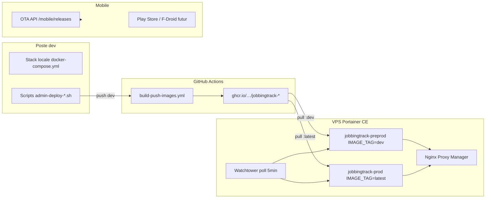

# Déploiement JobbingTrack — guide porteur

> Inspiré du flux [YTMusic](https://github.com/PavelDelhomme/YTMusic) (GHCR + Portainer CE + Watchtower).  
> Dernière mise à jour : **19 août 2026**

## Architecture



## Environnements

| Env | Branche Git | Tag GHCR | Stack Portainer | Usage |
|-----|-------------|----------|-----------------|-------|
| **Local dev** | `dev` (ou feature) | — | `docker-compose.yml` racine | Développement PC |
| **Préprod VPS** | `dev` | `:dev` | `jobbingtrack-preprod` | Tests HTTPS + OTA canal dev |
| **Prod VPS** | `main` | `:latest` / `:prod` | `jobbingtrack-prod` | Utilisation réelle |

Compose Portainer : `deploy/production/docker-compose.yml`  
Variables : copier `deploy/production/.env.example` dans Portainer (jamais dans Git).

---

## Checklist premier déploiement

### 1. DNS (OVH ou autre)

Entrées A vers l’IP du VPS, ex. :

- `jobbingtrack.delhomme.ovh` → frontend
- `api.jobbingtrack.delhomme.ovh` → API gateway

### 2. GitHub — packages GHCR publics

Portainer CE ne gère pas bien un registry privé sans credentials.

1. Push sur `dev` ou `main` → workflow **Build and Push Container Images**
2. GitHub → Packages → chaque `jobbingtrack-*` → **Change visibility → Public**  
   (le workflow tente automatiquement ; vérifier si échec)

### 3. Portainer — stack préprod

1. **Stacks → Add stack → Git repository**
2. Repo : `PavelDelhomme/JobbingTrack`
3. Branche : `dev`
4. Compose path : `deploy/production/docker-compose.yml`
5. **Environment variables** (mode avancé) — voir `deploy/production/.env.example` :
   - `IMAGE_REGISTRY=ghcr.io/paveldelhomme`
   - `IMAGE_TAG=dev`
   - `IMAGE_PULL_POLICY=always`
   - secrets postgres, JWT, SMTP, domaines HTTPS…
6. Nom stack : `jobbingtrack-preprod`
7. Deploy → vérifier `docker ps` (healthy)

Script de contrôle :

```bash
bash scripts/deploy/portainer-env-check.sh deploy/production/.env.preprod
```

### 4. Watchtower (recommandé — sans webhook Portainer Pro)

1. Stacks → Add stack → `watchtower`
2. Coller `deploy/watchtower-compose.yml`
3. Réseau externe `shared-network-copy` doit exister sur le VPS

Les services JobbingTrack portent le label `com.centurylinklabs.watchtower.enable=true` → pull auto ~5 min après build GHCR.

### 5. Nginx Proxy Manager

| Host | Forward | Port |
|------|---------|------|
| API | `jobbingtrack-api-gateway` ou IP host `127.0.0.1` | `3000` (voir `API_PUBLISH_PORT`) |
| Web | `jobbingtrack-frontend` ou IP host | `3001` (voir `FRONTEND_PUBLISH_PORT`) |

SSL Let’s Encrypt + Force SSL.  
Détails : `docs/deployment/VPS_PORTAINER_NPM_OVH.md`

### 6. Stack prod (plus tard)

Même compose, branche Git `main`, variables prod, `IMAGE_TAG=latest`, stack `jobbingtrack-prod`.

### 7. Secrets GitHub Actions (optionnels)

| Secret | Rôle |
|--------|------|
| `DEV_DEPLOY_URL` | Webhook Portainer préprod (si disponible) |
| `PROD_DEPLOY_URL` | Webhook prod |
| `PREPROD_DEPLOY_URL` + `PREPROD_DEPLOY_TOKEN` | Receiver custom (voir doc VPS §5.1) |

Sans secrets : **Watchtower** ou `bash scripts/deploy/redeploy-vps.sh`.

---

## Flux quotidien (depuis le PC)

Copier `.env.deploy.example` → `.env` (local, gitignored).

### Pousser en préprod (dev)

```bash
bash scripts/deploy/admin-deploy-dev.sh
```

→ push `dev` → build GHCR `:dev` → redeploy stack préprod (Portainer API ou Watchtower).

### Promouvoir en production

```bash
bash scripts/deploy/admin-deploy-prod.sh web
```

→ merge `dev` → `main` → build GHCR `:latest` → redeploy prod.

### Publier un APK distant (OTA)

```bash
DEPLOY_URL=https://api.jobbingtrack.delhomme.ovh \
  MOBILE_RELEASE_CHANNEL=dev \
  bash scripts/deploy/publish-apk-remote.sh
```

Canal **production** : `MOBILE_RELEASE_CHANNEL=production` ou `admin-deploy-prod.sh apk`.

Backoffice : `/backoffice/mobile/releases` (Build → Publish → Promote).

### Redeploy manuel VPS

```bash
bash scripts/deploy/redeploy-vps.sh preprod   # dev
bash scripts/deploy/redeploy-vps.sh prod      # main
```

Stratégies (ordre) : SSH → Portainer Access Token → message Watchtower.

---

## Version plateforme

Fichier `VERSION` (semver) + manifests `deploy/releases/JT-x.y.z.yaml`.

```bash
bash scripts/deploy/bump-platform-version.sh patch
git add VERSION deploy/releases/
git commit -m "chore: bump platform JT-x.y.z"
```

---

## Local vs VPS

| Action | Local | VPS |
|--------|-------|-----|
| Dev full stack | `docker compose up` (racine) | — |
| Compose préprod test | `make up-preprod` (Makefile deploy) | Portainer stack |
| Images | build local ou pull GHCR | pull GHCR `always` |
| Mobile OTA dev | `bash scripts/mobile/publish-built-dev.sh` | upload backoffice ou `publish-apk-remote.sh` |

---

## Canaux mobile (résumé)

| Canal | État | Doc |
|-------|------|-----|
| OTA interne (dev/prod) | **Implémenté** | `docs/production/MOBILE_RELEASE_PIPELINE.md` |
| GitHub Releases (tag `mobile-v*`) | CI workflow | `.github/workflows/mobile-release-android.yml` |
| Play Store | À brancher | `docs/deployment/CANAL_DISTRIBUTION_MOBILE.md` |
| F-Droid | À brancher | idem |

---

## Dépannage

| Symptôme | Piste |
|----------|-------|
| Portainer ne pull pas GHCR | Packages publics ? `IMAGE_PULL_POLICY=always` ? |
| Stack unhealthy | Logs conteneur ; postgres/redis secrets |
| Pas de redeploy auto | Watchtower stack ? label watchtower sur services ? |
| OTA ne propose pas MAJ | Canal dev/prod ; variables `MOBILE_ANDROID_*` ; APK dans volume |
| Webhook CI no-op | Normal sans secret — utiliser redeploy-vps.sh |

---

## Fichiers clés

| Fichier | Rôle |
|---------|------|
| `deploy/production/docker-compose.yml` | Stack Portainer |
| `deploy/watchtower-compose.yml` | MAJ auto CE |
| `.github/workflows/build-push-images.yml` | Build 16 images GHCR |
| `scripts/deploy/admin-deploy-dev.sh` | Push dev + redeploy préprod |
| `scripts/deploy/admin-deploy-prod.sh` | Promote main + redeploy prod |
| `scripts/deploy/redeploy-vps.sh` | Redeploy Portainer CE |
| `docs/production/PORTEUR_ACTIONS_DEPLOIEMENT.md` | Checklist porteur détaillée |

Pilotage Kanban : cartes **DEPLOY-GHA-01**, **DEPLOY-C1→C3**.
