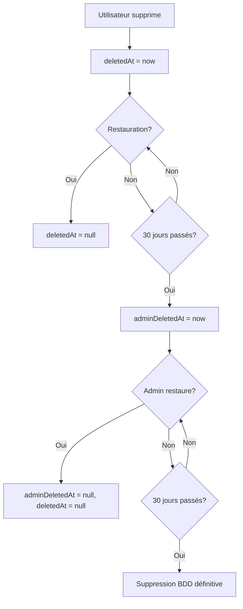

# 🎯 Plan des Prochaines Étapes - JobbingTrack

**Date**: 2025-10-10  
**Statut**: En cours de développement

---

## ✅ Ce qui fonctionne MAINTENANT

### Backend
- ✅ Tous les services avec routes CRUD complètes
- ✅ Routes `/health` pour tous les services
- ✅ API Admin pour contrôle des services Docker
- ✅ API Logs pour consultation des logs
- ✅ Soft delete et archivage (schéma défini)

### Frontend
- ✅ Sidebar scrollable
- ✅ Monitoring des services en temps réel
- ✅ Boutons redémarrer/arrêter services
- ✅ Page Logs & Activités
- ✅ Export/Import pour 8 types de données
- ✅ admin@jobbingtrack.test → SUPER_ADMIN

---

## 🔴 URGENT - À faire immédiatement

### 1. Reconnexion Utilisateur ⚠️
**Vous devez vous déconnecter et vous reconnecter** pour que votre nouveau rôle SUPER_ADMIN soit pris en compte.

Actions:
1. Clic sur 🚪 (déconnexion)
2. Login avec `admin@jobbingtrack.test` / `password123`
3. Nouveau token JWT avec SUPER_ADMIN
4. Les boutons de contrôle des services fonctionneront

---

## 📋 Prochaines Étapes par Priorité

### 🔥 Priorité HAUTE

#### 1. Système de Corbeille Multi-Niveaux
**Concept**: Trois niveaux de suppression

```
[Suppression Utilisateur]
    ↓
[Corbeille Utilisateur] (deletedAt + userId)
    ↓ 30 jours
[Corbeille Admin] (adminDeletedAt + canRestore=true)
    ↓ 30 jours (ou action admin)
[Suppression Définitive] (vraie suppression BDD)
```

**Modifications requises dans les schémas**:
```prisma
model Application {
  // ... champs existants
  deletedAt       DateTime?  // Mise à la corbeille utilisateur
  deletedBy       String?    // ID de l'utilisateur qui a supprimé
  adminDeletedAt  DateTime?  // Mise à la corbeille admin
  adminDeletedBy  String?    // ID de l'admin qui a supprimé
  canRestore      Boolean    @default(true) // Peut être restauré
  archivedAt      DateTime?  // Archivage
}
```

**Logique de suppression**:
1. User clique "Supprimer" → `deletedAt = now()`, `deletedBy = userId`
2. Après 30 jours → CRON job → `adminDeletedAt = now()`
3. Admin peut restaurer si `canRestore = true`
4. Admin clique "Supprimer définitivement" → `canRestore = false`
5. Après 30 jours de `adminDeletedAt` → Vraie suppression BDD

#### 2. Routes de Gestion de la Corbeille

**Routes Utilisateur** (chaque service):
```javascript
GET    /api/v1/applications/trash       // Liste corbeille
GET    /api/v1/applications/archived    // Liste archives
PUT    /api/v1/applications/:id/restore // Restaurer
DELETE /api/v1/applications/:id/soft    // Soft delete (déjà fait)
```

**Routes Admin** (API Gateway):
```javascript
GET    /api/v1/admin/trash/:userId           // Corbeille d'un user
GET    /api/v1/admin/trash/all                // Toutes les corbeilles
GET    /api/v1/admin/trash/global             // Corbeille admin (30j+)
PUT    /api/v1/admin/trash/:entity/:id/restore // Restaurer pour un user
DELETE /api/v1/admin/trash/:entity/:id/permanent // Suppression définitive
```

#### 3. UI Corbeille/Archives

**Onglets à ajouter partout**:
```tsx
<Tabs>
  <Tab name="Actifs">       // deletedAt = null AND archivedAt = null
  <Tab name="Archives">     // archivedAt != null AND deletedAt = null
  <Tab name="Corbeille">    // deletedAt != null
</Tabs>
```

**Pages à modifier**:
- `/backoffice/applications`
- `/backoffice/contacts`
- `/backoffice/interviews`
- `/backoffice/calls`
- `/backoffice/followups`
- `/backoffice/events`
- `/backoffice/notifications`

**Nouvelle page admin**:
- `/backoffice/trash-management` - Gestion globale des corbeilles

---

### 🟠 Priorité MOYENNE

#### 4. CRON Job de Nettoyage Automatique

Créer un service dédié : `scheduler-service`

**Tâches**:
- Déplacer de la corbeille user → corbeille admin (30 jours)
- Supprimer définitivement (60 jours total)
- Nettoyage des logs anciens
- Archivage auto des vieilles candidatures (1 an)

**Technologies**: `node-cron` ou `bull` (avec Redis)

#### 5. Synchronisation des Schémas Prisma

**À faire**: Copier les modifications de `call-service/prisma/schema.prisma` vers:
- ✅ `backend/application-service/prisma/schema.prisma`
- ✅ `backend/interview-service/prisma/schema.prisma`
- ✅ `backend/followup-service/prisma/schema.prisma`
- ✅ `backend/event-service/prisma/schema.prisma`
- ✅ `backend/contact-service/prisma/schema.prisma`
- ✅ `backend/notification-service/prisma/schema.prisma`
- ✅ `backend/company-service/prisma/schema.prisma`
- ✅ `backend/dashboard-service/prisma/schema.prisma`
- ✅ `backend/prisma/schema.prisma` (schéma global)

**Nouveautés à synchroniser**:
- Modèle `Call`
- Modèle `ApplicationContact`
- Champs `deletedAt`, `archivedAt`, `deletedBy`, `adminDeletedAt`, `adminDeletedBy`, `canRestore`
- ENUMS `CallType`, `CallStatus`

#### 6. Migrations Prisma

Exécuter pour chaque service:
```bash
cd backend/call-service
npx prisma migrate dev --name add_soft_delete_system

cd ../application-service
npx prisma migrate dev --name add_soft_delete_system

# Répéter pour tous les services...
```

---

### 🟢 Priorité BASSE

#### 7. Amélioration Logs & Activités

**Fonctionnalités à ajouter**:
- ✅ Logs en temps réel (WebSocket ou polling)
- ✅ Filtrage par niveau (ERROR, WARN, INFO)
- ✅ Recherche dans les logs
- ✅ Export des logs au format .log ou .txt
- ✅ Statistiques des erreurs

#### 8. Dashboard Utilisateur - Corbeille

Dans le dashboard utilisateur (non-admin):
- Section "Corbeille" accessible depuis le menu principal
- Possibilité de restaurer ses propres éléments
- Message "Suppression définitive dans X jours"

#### 9. Tests Automatisés

**Tests à créer**:
```bash
tests/
├── soft-delete.test.js      # Tester la suppression douce
├── cascade.test.js          # Tester les cascades
├── restore.test.js          # Tester la restauration
├── cron-cleanup.test.js     # Tester le nettoyage auto
└── admin-trash.test.js      # Tester la gestion admin
```

---

## 🗺️ Architecture du Système de Corbeille

### Flux de Suppression



### Base de Données

**Tables principales modifiées**:
```sql
-- Exemple pour Application
ALTER TABLE "Application" ADD COLUMN "deletedAt" TIMESTAMP;
ALTER TABLE "Application" ADD COLUMN "deletedBy" TEXT;
ALTER TABLE "Application" ADD COLUMN "adminDeletedAt" TIMESTAMP;
ALTER TABLE "Application" ADD COLUMN "adminDeletedBy" TEXT;
ALTER TABLE "Application" ADD COLUMN "canRestore" BOOLEAN DEFAULT true;
ALTER TABLE "Application" ADD COLUMN "archivedAt" TIMESTAMP;
```

---

## 📊 Nouvelles Pages à Créer

### 1. Page Gestion Globale de la Corbeille
**Route**: `/backoffice/trash-management`

**Fonctionnalités**:
- Vue par utilisateur
- Filtres: Type d'entité, date de suppression, recherche
- Actions: Restaurer, Supprimer définitivement
- Statistiques: Nb d'éléments en corbeille, espace récupérable

**Sections**:
```
┌─────────────────────────────────────────────────────┐
│ 🗑️ Gestion Globale de la Corbeille                  │
├─────────────────────────────────────────────────────┤
│ [Par Utilisateur] [Par Type] [Corbeille Admin]     │
│                                                      │
│ Filtres: User | Type | Date | Recherche             │
│                                                      │
│ Tableau:                                             │
│ - Élément                                            │
│ - Type (Candidature, Contact, etc.)                 │
│ - Supprimé par                                       │
│ - Date suppression                                   │
│ - Jours restants avant suppression auto             │
│ - Actions: [Restaurer] [Supprimer définitivement]   │
└─────────────────────────────────────────────────────┘
```

### 2. Page Archives par Utilisateur
**Route**: `/backoffice/archives-management`

Même concept mais pour les archives (`archivedAt != null`)

---

## 🔧 Modifications des Controllers

### Exemple: Application Controller

```javascript
// Liste normale (actifs seulement)
async getApplications(req, res) {
  const applications = await prisma.application.findMany({
    where: {
      userId: req.user.id,
      deletedAt: null,
      archivedAt: null
    }
  });
}

// Liste de la corbeille
async getTrash(req, res) {
  const applications = await prisma.application.findMany({
    where: {
      userId: req.user.id,
      deletedAt: { not: null }
    },
    orderBy: { deletedAt: 'desc' }
  });
}

// Liste des archives
async getArchived(req, res) {
  const applications = await prisma.application.findMany({
    where: {
      userId: req.user.id,
      archivedAt: { not: null },
      deletedAt: null
    },
    orderBy: { archivedAt: 'desc' }
  });
}

// Restaurer depuis la corbeille
async restore(req, res) {
  const { id } = req.params;
  
  await prisma.application.update({
    where: { id },
    data: {
      deletedAt: null,
      deletedBy: null,
      adminDeletedAt: null,
      adminDeletedBy: null
    }
  });
  
  res.json({ success: true });
}

// Soft delete (corbeille utilisateur)
async softDelete(req, res) {
  const { id } = req.params;
  
  await prisma.application.update({
    where: { id },
    data: {
      deletedAt: new Date(),
      deletedBy: req.user.id
    }
  });
}

// Suppression définitive (admin seulement)
async permanentDelete(req, res) {
  if (req.user.role !== 'SUPER_ADMIN') {
    return res.status(403).json({ error: 'Accès refusé' });
  }
  
  const { id } = req.params;
  
  // Vraie suppression en cascade
  await prisma.application.delete({
    where: { id }
  });
}
```

---

## 📝 Checklist Complète

### Phase 1: Corbeille de Base ⏳
- [ ] Ajouter les champs de suppression multi-niveaux à tous les schémas
- [ ] Créer les routes `trash`, `archived`, `restore` pour chaque service
- [ ] Modifier tous les controllers pour filtrer `deletedAt = null`
- [ ] Créer l'UI avec onglets [Actifs] [Archives] [Corbeille]
- [ ] Tester le cycle: Supprimer → Restaurer → Supprimer définitivement

### Phase 2: Gestion Admin 🔧
- [ ] Page `/backoffice/trash-management` (vue globale)
- [ ] Page `/backoffice/archives-management` (vue globale)
- [ ] Filtres par utilisateur, type, date
- [ ] Actions de restauration en masse
- [ ] Statistiques de la corbeille

### Phase 3: CRON Jobs ⏰
- [ ] Créer le `scheduler-service`
- [ ] Job: Corbeille user → Corbeille admin (30j)
- [ ] Job: Suppression définitive (60j total)
- [ ] Job: Archivage auto vieilles candidatures (1 an)
- [ ] Job: Nettoyage logs anciens (90j)

### Phase 4: Synchronisation Schémas 🔄
- [ ] Synchroniser `Call` vers tous les services
- [ ] Synchroniser `ApplicationContact` vers tous les services
- [ ] Synchroniser champs soft delete vers tous les services
- [ ] Exécuter migrations Prisma sur tous les services

### Phase 5: Tests & Documentation 📚
- [ ] Tests unitaires pour soft delete
- [ ] Tests d'intégration cascade
- [ ] Documentation utilisateur
- [ ] Vidéos tutoriels

---

## 🎨 Design UI - Exemples de Pages

### Page Candidatures avec Onglets

```tsx
export default function ApplicationsPage() {
  const [activeTab, setActiveTab] = useState<'active' | 'archived' | 'trash'>('active')
  
  return (
    <div>
      {/* Tabs */}
      <div className="flex space-x-4 mb-6">
        <TabButton
          active={activeTab === 'active'}
          onClick={() => setActiveTab('active')}
          label="📝 Actifs"
          count={activeCount}
        />
        <TabButton
          active={activeTab === 'archived'}
          onClick={() => setActiveTab('archived')}
          label="📦 Archives"
          count={archivedCount}
        />
        <TabButton
          active={activeTab === 'trash'}
          onClick={() => setActiveTab('trash')}
          label="🗑️ Corbeille"
          count={trashCount}
        />
      </div>
      
      {/* Content selon l'onglet */}
      {activeTab === 'active' && <ActiveApplications />}
      {activeTab === 'archived' && <ArchivedApplications />}
      {activeTab === 'trash' && <TrashedApplications />}
    </div>
  )
}
```

### Page Gestion Globale Corbeille (Admin)

```tsx
export default function TrashManagementPage() {
  return (
    <AdminLayout>
      <div>
        <h1>🗑️ Gestion Globale de la Corbeille</h1>
        
        {/* Statistiques */}
        <div className="grid grid-cols-4 gap-4">
          <StatCard title="Total corbeille" value={totalTrash} />
          <StatCard title="Suppression < 7j" value={recent} color="yellow" />
          <StatCard title="Suppression > 30j" value={old} color="red" />
          <StatCard title="Restaurables" value={restorable} color="green" />
        </div>
        
        {/* Filtres */}
        <Filters>
          <Select name="utilisateur" options={users} />
          <Select name="type" options={['Candidature', 'Contact', ...]} />
          <DateRange name="période" />
          <Input name="recherche" placeholder="Rechercher..." />
        </Filters>
        
        {/* Tableau */}
        <Table>
          <Column name="Type" />
          <Column name="Titre/Nom" />
          <Column name="Utilisateur" />
          <Column name="Supprimé le" />
          <Column name="Jours restants" />
          <Column name="Actions">
            <Button>♻️ Restaurer</Button>
            <Button danger>🗑️ Supprimer</Button>
          </Column>
        </Table>
      </div>
    </AdminLayout>
  )
}
```

---

## 🔐 Permissions & Sécurité

### Rôles et Droits

| Action | USER | ADMIN | SUPER_ADMIN |
|--------|------|-------|-------------|
| Voir sa corbeille | ✅ | ✅ | ✅ |
| Restaurer ses éléments | ✅ | ✅ | ✅ |
| Voir corbeille globale | ❌ | ✅ | ✅ |
| Restaurer pour un user | ❌ | ✅ | ✅ |
| Suppression définitive | ❌ | ❌ | ✅ |
| Gérer CRON jobs | ❌ | ❌ | ✅ |
| Contrôler services Docker | ❌ | ❌ | ✅ |

---

## 📅 Timeline Estimée

### Sprint 1 (3-5 jours)
- Schémas Prisma multi-niveaux
- Routes trash/archived/restore
- UI onglets basiques
- Tests manuels

### Sprint 2 (2-3 jours)
- Page admin corbeille globale
- Filtres et recherche
- Actions en masse
- Tests automatisés

### Sprint 3 (2-3 jours)
- CRON jobs scheduler
- Notifications avant suppression
- Dashboard statistiques
- Documentation

---

## 🧪 Commandes de Test

### Tester le nouveau système après implémentation

```bash
# 1. Créer une candidature
curl -X POST http://localhost:3000/api/v1/applications \
  -H "Authorization: Bearer $TOKEN" \
  -d '{"companyId": "xxx", "position": "Dev"}'

# 2. Soft delete
curl -X DELETE http://localhost:3000/api/v1/applications/xxx \
  -H "Authorization: Bearer $TOKEN"

# 3. Voir la corbeille
curl http://localhost:3000/api/v1/applications/trash \
  -H "Authorization: Bearer $TOKEN"

# 4. Restaurer
curl -X PUT http://localhost:3000/api/v1/applications/xxx/restore \
  -H "Authorization: Bearer $TOKEN"

# 5. Suppression définitive (admin)
curl -X DELETE http://localhost:3000/api/v1/admin/trash/application/xxx/permanent \
  -H "Authorization: Bearer $ADMIN_TOKEN"
```

---

## 📚 Documentation à Créer

### Pour les Développeurs
- `ARCHITECTURE-CORBEILLE.md` - Explication complète du système
- `API-TRASH.md` - Documentation des routes
- `SCHEMAS-UPDATED.md` - Changelog des schémas

### Pour les Utilisateurs
- `GUIDE-CORBEILLE.md` - Comment utiliser la corbeille
- `FAQ-SUPPRESSION.md` - Questions fréquentes
- Vidéo démo (5 min)

---

## 🚀 Résumé Visuel

```
Votre Application Actuelle
├── ✅ Monitoring services
├── ✅ Contrôle Docker (redémarrer/arrêter)
├── ✅ Logs en temps réel
├── ✅ Export/Import 8 types données
├── ✅ CRUD complet tous services
├── ✅ Auth avec SUPER_ADMIN
├── ⏳ Corbeille multi-niveaux (à implémenter)
├── ⏳ Archives (à implémenter)
├── ⏳ CRON jobs (à implémenter)
└── ⏳ Tests automatisés (à implémenter)
```

---

## ✨ Ce qui rend votre système unique

1. **Corbeille à 3 niveaux** - Protection maximale contre les suppressions accidentelles
2. **Rétention intelligente** - 30+30 jours avec CRON automatique
3. **Gestion admin avancée** - Vue globale de toutes les corbeilles
4. **Contrôle Docker intégré** - Redémarrage de services depuis l'UI
5. **Logs en temps réel** - Débogage facile

---

**Prochaine action**: 
1. ✅ Déconnexion/reconnexion pour obtenir le rôle SUPER_ADMIN
2. ✅ Tester les boutons de contrôle des services
3. ✅ Tester la page Logs & Activités
4. ⏳ Commencer l'implémentation du système de corbeille multi-niveaux

**Dernière mise à jour**: 2025-10-10 16:00

