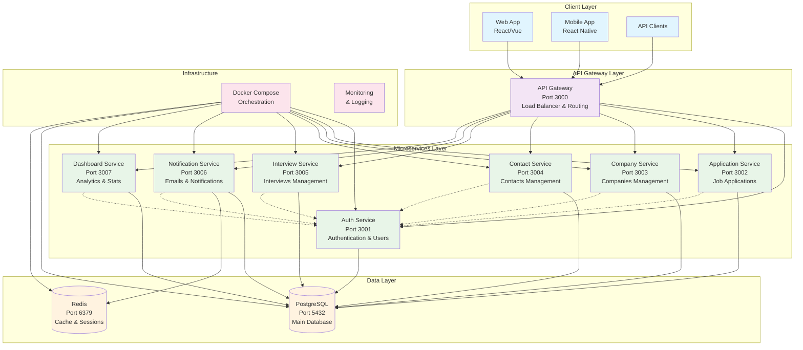
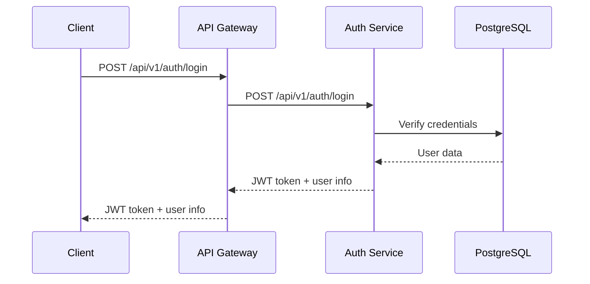
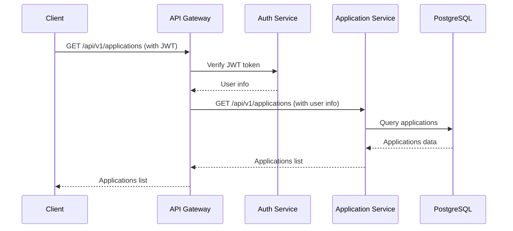
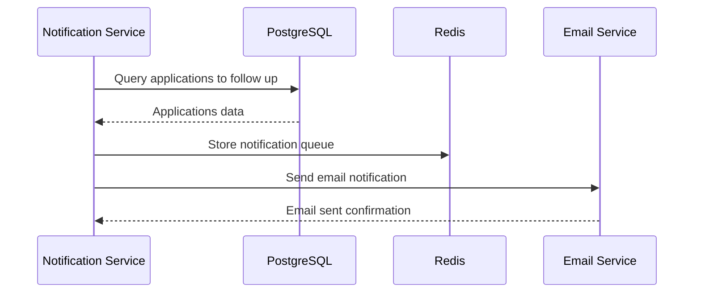

# 🏗️ Architecture Microservices JobbingTrack

## Diagramme d'architecture



## Flux de données

### 1. Authentification


### 2. Gestion des candidatures


### 3. Notifications


## Avantages de l'architecture microservices

### ✅ Scalabilité
- Chaque service peut être mis à l'échelle indépendamment
- Load balancing au niveau de l'API Gateway
- Cache Redis pour améliorer les performances

### ✅ Maintenabilité
- Code modulaire et séparé par domaine métier
- Déploiement indépendant de chaque service
- Tests isolés par service

### ✅ Résilience
- Isolation des pannes (un service en panne n'affecte pas les autres)
- Circuit breaker pattern possible
- Retry mechanisms

### ✅ Flexibilité technologique
- Chaque service peut utiliser des technologies différentes
- Évolution indépendante des services
- Migration progressive possible

## Communication inter-services

### Synchronous (HTTP REST)
- API Gateway ↔ Services
- Services ↔ Services (pour l'authentification)
- Client ↔ API Gateway

### Asynchronous (Events)
- Notification Service (cron jobs)
- Event-driven updates
- Background processing

## Sécurité

### Authentication & Authorization
- JWT tokens gérés par Auth Service
- Middleware d'authentification dans chaque service
- Rate limiting sur l'API Gateway

### Network Security
- Communication inter-services via réseau Docker privé
- Variables d'environnement pour les secrets
- HTTPS en production

## Monitoring & Observabilité

### Logs
- Logs centralisés via Docker Compose
- Winston logger dans chaque service
- Structured logging (JSON)

### Health Checks
- Endpoint `/health` sur chaque service
- Health checks Docker
- Monitoring des dépendances

### Metrics
- Response times
- Error rates
- Throughput
- Resource utilization

## Déploiement

### Développement
```bash
make dev
```

### Production
```bash
make build
make up
```

### CI/CD
- Build automatique des images Docker
- Tests automatisés
- Déploiement blue-green possible
