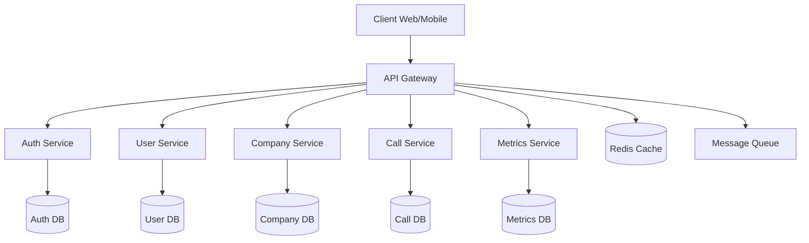
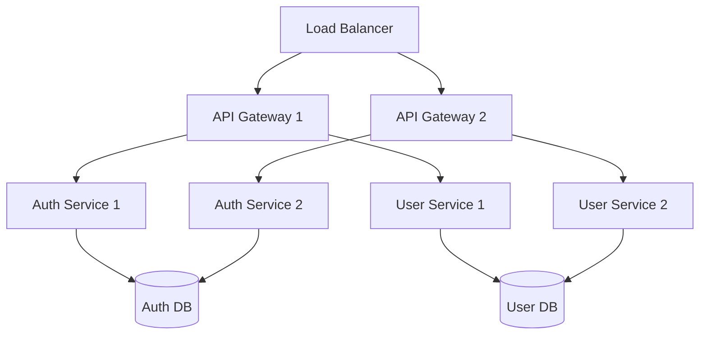

# Architecture du Système - JobbingTrack

[← Retour au README principal](../README.md)

## 🎯 Vue d'ensemble

JobbingTrack est construit sur une architecture de microservices moderne, conçue pour être scalable, maintenable et performante.

## 📋 Table des matières

- [🏗️ Architecture générale](#️-architecture-générale)
- [🔗 API Gateway](#-api-gateway)
- [🏢 Microservices](#-microservices)
- [💾 Base de données](#-base-de-données)
- [📊 Monitoring](#-monitoring)
- [🔒 Sécurité](#-sécurité)
- [🚀 Déploiement](#-déploiement)

---

## 🏗️ Architecture générale

### Vue d'ensemble



### Composants principaux

1. **API Gateway** : Point d'entrée unique
2. **Microservices** : Services métier spécialisés
3. **Base de données** : PostgreSQL pour chaque service
4. **Cache** : Redis pour les performances
5. **Monitoring** : Prometheus + Grafana
6. **Frontend** : Next.js (dashboard admin)

---

## 🔗 API Gateway

### Responsabilités

- **Routage** : Redirection des requêtes vers les bons services
- **Authentification** : Vérification des tokens JWT
- **Rate Limiting** : Limitation du nombre de requêtes
- **Logging** : Journalisation centralisée
- **Monitoring** : Collecte de métriques

### Configuration

```javascript
// Exemple de configuration du gateway
const services = {
  auth: 'http://auth-service:3001',
  user: 'http://user-service:3002',
  company: 'http://company-service:3003',
  call: 'http://call-service:3004'
};

// Routage
app.use('/auth', proxy(services.auth));
app.use('/users', authenticate, proxy(services.user));
app.use('/companies', authenticate, proxy(services.company));
```

---

## 🏢 Microservices

### Service d'authentification (Auth Service)

**Port** : 3001  
**Base de données** : PostgreSQL (auth_db)

**Responsabilités** :
- Authentification des utilisateurs
- Gestion des tokens JWT
- Gestion des rôles et permissions
- Validation des sessions

**Endpoints principaux** :
- `POST /auth/login` - Connexion
- `POST /auth/register` - Inscription
- `POST /auth/refresh` - Rafraîchissement token
- `GET /auth/verify` - Vérification token

### Service utilisateur (User Service)

**Port** : 3002  
**Base de données** : PostgreSQL (user_db)

**Responsabilités** :
- Gestion des profils utilisateur
- Préférences utilisateur
- Historique des actions
- Gestion des notifications

**Endpoints principaux** :
- `GET /users/profile` - Profil utilisateur
- `PUT /users/profile` - Mise à jour profil
- `PUT /users/password` - Changement mot de passe

### Service entreprise (Company Service)

**Port** : 3003  
**Base de données** : PostgreSQL (company_db)

**Responsabilités** :
- Gestion des entreprises
- Informations des entreprises
- Relations entre entreprises
- Historique des interactions

**Endpoints principaux** :
- `GET /companies` - Liste des entreprises
- `POST /companies` - Créer une entreprise
- `PUT /companies/:id` - Mettre à jour
- `DELETE /companies/:id` - Supprimer

### Service d'appels (Call Service)

**Port** : 3004  
**Base de données** : PostgreSQL (call_db)

**Responsabilités** :
- Gestion des appels téléphoniques
- Planification des appels
- Suivi des appels
- Notes et commentaires

**Endpoints principaux** :
- `GET /calls` - Liste des appels
- `POST /calls` - Créer un appel
- `PUT /calls/:id` - Mettre à jour
- `DELETE /calls/:id` - Supprimer

### Service de métriques (Metrics Service)

**Port** : 3005  
**Base de données** : PostgreSQL (metrics_db)

**Responsabilités** :
- Collecte de métriques système
- Métriques d'utilisation
- Rapports de performance
- Alertes

**Endpoints principaux** :
- `GET /metrics` - Métriques système
- `GET /metrics/detailed` - Métriques détaillées
- `POST /metrics/alert` - Créer une alerte

---

## 💾 Base de données

### Architecture des données

Chaque microservice possède sa propre base de données PostgreSQL, garantissant :

- **Isolation** : Les données sont isolées par service
- **Scalabilité** : Chaque service peut être mis à l'échelle indépendamment
- **Sécurité** : Accès limité aux données par service

### Schéma des bases de données

#### Base d'authentification (auth_db)

```sql
-- Table des utilisateurs
CREATE TABLE users (
    id UUID PRIMARY KEY DEFAULT gen_random_uuid(),
    email VARCHAR(255) UNIQUE NOT NULL,
    password_hash VARCHAR(255) NOT NULL,
    role VARCHAR(50) DEFAULT 'user',
    created_at TIMESTAMP DEFAULT CURRENT_TIMESTAMP,
    updated_at TIMESTAMP DEFAULT CURRENT_TIMESTAMP
);

-- Table des sessions
CREATE TABLE sessions (
    id UUID PRIMARY KEY DEFAULT gen_random_uuid(),
    user_id UUID REFERENCES users(id),
    token VARCHAR(500) NOT NULL,
    expires_at TIMESTAMP NOT NULL,
    created_at TIMESTAMP DEFAULT CURRENT_TIMESTAMP
);
```

#### Base utilisateur (user_db)

```sql
-- Table des profils
CREATE TABLE profiles (
    id UUID PRIMARY KEY DEFAULT gen_random_uuid(),
    user_id UUID NOT NULL,
    name VARCHAR(255),
    phone VARCHAR(50),
    preferences JSONB,
    created_at TIMESTAMP DEFAULT CURRENT_TIMESTAMP,
    updated_at TIMESTAMP DEFAULT CURRENT_TIMESTAMP
);
```

#### Base entreprise (company_db)

```sql
-- Table des entreprises
CREATE TABLE companies (
    id UUID PRIMARY KEY DEFAULT gen_random_uuid(),
    name VARCHAR(255) NOT NULL,
    description TEXT,
    website VARCHAR(255),
    contact_email VARCHAR(255),
    created_at TIMESTAMP DEFAULT CURRENT_TIMESTAMP,
    updated_at TIMESTAMP DEFAULT CURRENT_TIMESTAMP
);
```

---

## 📊 Monitoring

### Stack de monitoring

- **Prometheus** : Collecte de métriques
- **Grafana** : Visualisation et tableaux de bord
- **cAdvisor** : Métriques des conteneurs Docker
- **AlertManager** : Gestion des alertes

### Métriques collectées

#### Métriques système
- CPU, mémoire, disque
- Réseau et I/O
- Temps de réponse des services

#### Métriques applicatives
- Nombre de requêtes par endpoint
- Taux d'erreur
- Temps de réponse des APIs
- Utilisation des bases de données

### Configuration Prometheus

```yaml
# prometheus.yml
global:
  scrape_interval: 15s

scrape_configs:
  - job_name: 'api-gateway'
    static_configs:
      - targets: ['api-gateway:3000']
  
  - job_name: 'auth-service'
    static_configs:
      - targets: ['auth-service:3001']
  
  - job_name: 'node-exporter'
    static_configs:
      - targets: ['node-exporter:9100']
```

---

## 🔒 Sécurité

### Authentification

- **JWT Tokens** : Authentification stateless
- **Refresh Tokens** : Renouvellement automatique
- **Rate Limiting** : Protection contre les attaques

### Autorisation

- **RBAC** : Role-Based Access Control
- **Permissions granulaires** : Contrôle d'accès fin
- **Audit Trail** : Traçabilité des actions

### Chiffrement

- **HTTPS** : Communication chiffrée
- **Bcrypt** : Hachage des mots de passe
- **Secrets** : Gestion sécurisée des secrets

---

## 🚀 Déploiement

### Architecture de déploiement



### Stratégies de déploiement

1. **Blue-Green** : Déploiement sans interruption
2. **Canary** : Déploiement progressif
3. **Rolling** : Déploiement par étapes

### Configuration Docker

```dockerfile
# Exemple Dockerfile pour un service
FROM node:20-alpine

WORKDIR /app
COPY package*.json ./
RUN npm ci --only=production

COPY src/ ./src/
EXPOSE 3000

CMD ["node", "src/index.js"]
```

---

## 📈 Scalabilité

### Scaling horizontal

- **Load Balancing** : Répartition de charge
- **Auto-scaling** : Mise à l'échelle automatique
- **Database Sharding** : Partitionnement des données

### Optimisations

- **Caching** : Redis pour les performances
- **CDN** : Distribution de contenu
- **Database Indexing** : Optimisation des requêtes

---

## 🔄 Communication entre services

### Synchronous Communication

- **HTTP/REST** : Communication directe
- **API Gateway** : Point d'entrée unique

### Asynchronous Communication

- **Message Queue** : Communication asynchrone
- **Event Sourcing** : Traçabilité des événements

---

## 📚 Ressources supplémentaires

- [Guide de développement](DEVELOPMENT.md) - Développement
- [Documentation API](API.md) - APIs disponibles
- [Guide de déploiement](deployment-guide.md) - Déploiement
- [Documentation Makefile](MAKEFILE.md) - Commandes Make

---

[← Retour au README principal](../README.md) | [Documentation API →](API.md)
