# 🏗️ Architecture Microservices - JobbingTrack

Documentation complète de l'architecture technique de JobbingTrack v4.1.

[← Retour à la documentation](../../README.md) | [← README principal](../../../README.md) | [🧭 Navigation](../../navigation.md)

## 🎯 Vue d'ensemble

JobbingTrack est construit sur une **architecture microservices moderne**, conçue pour être scalable, maintenable et performante. Le système gère le suivi complet des candidatures avec un dashboard administrateur et une architecture distribuée.

## 📋 Table des matières

- [🏗️ Architecture générale](#️-architecture-générale)
- [🔗 API Gateway](#-api-gateway)
- [🏢 Microservices](#-microservices)
- [💾 Base de données](#-base-de-données)
- [📊 Monitoring](#-monitoring)
- [🔒 Sécurité](#-sécurité)
- [🚀 Déploiement](#-déploiement)
- [📱 Applications mobiles](#-applications-mobiles)
- [🔄 Communication inter-services](#-communication-inter-services)
- [📈 Scalabilité et performance](#-scalabilité-et-performance)
- [🎨 Patterns et bonnes pratiques](#-patterns-et-bonnes-pratiques)

---

## 🏗️ Architecture générale

### Vue d'ensemble complète

```mermaid
graph TB
    subgraph "Clients"
        Web[🌐 Frontend Next.js<br/>Port: 8000]
        Mobile[📱 Flutter Mobile<br/>Port: 8090]
        API[🔌 API Gateway<br/>Port: 3000]
    end

    subgraph "Services Essentiels"
        Postgres[(🗄️ PostgreSQL<br/>Port: 5432)]
        Redis[(💾 Redis Cache<br/>Port: 6379]
        MetricsAgg[📊 Metrics Aggregator<br/>Port: 8082:3014]
        cAdvisor[🖥️ cAdvisor<br/>Port: 8081:8080]
        Prometheus[📈 Prometheus<br/>Port: 9090]
        Grafana[📊 Grafana<br/>Port: 8083:3000]
        NodeExp[💻 Node Exporter<br/>Port: 8084:9100]
        AlertMgr[⚠️ Alertmanager<br/>Port: 8085:9093]
        Blackbox[📦 Blackbox Exporter<br/>Port: 8086:9115]
    end

    subgraph "Services Backend"
        Auth[🔐 Auth Service<br/>Port: 3001]
        Application[📋 Application Service<br/>Port: 3002]
        Company[🏢 Company Service<br/>Port: 3003]
        Contact[👥 Contact Service<br/>Port: 3004]
        Interview[🎤 Interview Service<br/>Port: 3005]
        Call[📞 Call Service<br/>Port: 3006]
        Event[📅 Event Service<br/>Port: 3007]
        Followup[🔄 Followup Service<br/>Port: 3008]
        Profile[👤 Profile Service<br/>Port: 3009]
        Notification[🔔 Notification Service<br/>Port: 3010]
        Workflow[⚙️ Workflow Service<br/>Port: 3011]
        Dashboard[📊 Dashboard Service<br/>Port: 3012]
        Security[🔒 Security Service<br/>Port: 3013]
        SystemMetrics[📈 System Metrics<br/>Port: 3018]
        Deployment[🚀 Deployment Service<br/>Port: 3016]
        DockerStats[🐳 Docker Stats<br/>Port: 3015]
    end

    subgraph "Monitoring"
        Prometheus[📊 Prometheus<br/>Port: 9090]
        Grafana[📈 Grafana<br/>Port: 3001]
    end

    %% Connexions clients
    Web --> API
    Mobile --> API
    API --> Auth
    API --> Application
    API --> Company
    API --> Contact
    API --> Interview
    API --> Call
    API --> Event
    API --> Followup
    API --> Profile
    API --> Notification
    API --> Workflow
    API --> Dashboard
    API --> Security
    API --> SystemMetrics
    API --> Deployment
    API --> DockerStats

    %% Connexions bases de données
    Auth --> Postgres
    Application --> Postgres
    Company --> Postgres
    Contact --> Postgres
    Interview --> Postgres
    Call --> Postgres
    Event --> Postgres
    Followup --> Postgres
    Profile --> Postgres
    Notification --> Postgres
    Workflow --> Postgres
    Dashboard --> Postgres
    Security --> Postgres
    SystemMetrics --> Postgres
    Deployment --> Postgres

    %% Connexions cache et monitoring
    Auth --> Redis
    Notification --> Redis
    MetricsAgg --> cAdvisor
    MetricsAgg --> Prometheus
    cAdvisor --> Prometheus
    SystemMetrics --> Prometheus
    DockerStats --> cAdvisor

    %% Monitoring
    Prometheus --> Grafana
```

### Vue simplifiée (ASCII)

```
┌─────────────────────────────────────────────────────────────────┐
│                          CLIENTS                                 │
├─────────────────────────────────────────────────────────────────┤
│  🌐 Web Frontend (Next.js)      📱 Mobile App (Flutter)        │
│  📡 API Gateway (Express)       🔧 Admin Dashboard             │
└─────────────────────────────────────────────────────────────────┘
                                │
┌─────────────────────────────────────────────────────────────────┐
│                    MICROSERVICES BACKEND                         │
├─────────────────────────────────────────────────────────────────┤
│  🔐 Auth Service      📝 Application Service    🏢 Company Service │
│  👥 Contact Service   📅 Interview Service     🔔 Notification S. │
│  📊 Dashboard Service 📞 Call Service         🎯 Profile Service │
│  📧 Event Service     🔄 Followup Service      ⚙️ Workflow Service │
│  🔒 Security Service  📈 System Metrics        🚀 Deployment S.   │
└─────────────────────────────────────────────────────────────────┘
                                │
┌─────────────────────────────────────────────────────────────────┐
│                    INFRASTRUCTURE                                 │
├─────────────────────────────────────────────────────────────────┤
│  🗄️ PostgreSQL 15     💾 Redis 7              📊 Prometheus      │
│  📈 Grafana           🔍 Jaeger                🐳 Docker         │
│  ⚙️ Nginx Proxy       🔒 SSL/TLS              📝 Logging         │
└─────────────────────────────────────────────────────────────────┘
```

### Composants principaux

1. **API Gateway** : Point d'entrée unique (Port 3000)
2. **Frontend Next.js** : Interface web moderne (Port 8080)
3. **Microservices** : 18+ services métier spécialisés
4. **Base de données** : PostgreSQL centralisée avec schémas séparés
5. **Cache** : Redis pour les sessions et performances
6. **Monitoring** : Prometheus + Grafana + cAdvisor
7. **Applications mobiles** : Flutter pour iOS/Android

---

## 🔗 API Gateway

### Responsabilités

- **Routage** : Redirection des requêtes vers les bons services
- **Authentification** : Vérification des tokens JWT
- **Rate Limiting** : Limitation du nombre de requêtes
- **Logging** : Journalisation centralisée
- **Monitoring** : Collecte de métriques
- **CORS** : Gestion des origines autorisées
- **Load Balancing** : Répartition de charge entre services

### Configuration

```javascript
// Exemple de configuration du gateway
const services = {
  auth: 'http://auth-service:3001',
  applications: 'http://application-service:3002',
  companies: 'http://company-service:3003',
  contacts: 'http://contact-service:3004',
  interviews: 'http://interview-service:3005',
  calls: 'http://call-service:3006',
  events: 'http://event-service:3007',
  followups: 'http://followup-service:3008',
  profiles: 'http://profile-service:3009',
  notifications: 'http://notification-service:3010',
  workflows: 'http://workflow-service:3011',
  dashboard: 'http://dashboard-service:3012',
  security: 'http://security-service:3013',
  metrics: 'http://system-metrics-service:3018',
  deployment: 'http://deployment-service:3016',
  dockerstats: 'http://docker-stats-service:3015'
};

// Routage avec authentification
app.use('/api/auth', proxy(services.auth));
app.use('/api/applications', authenticate, proxy(services.applications));
app.use('/api/companies', authenticate, proxy(services.companies));

// Rate limiting
app.use('/api', rateLimit({
  windowMs: 15 * 60 * 1000, // 15 minutes
  max: 1000, // limite de 1000 requêtes par fenêtre
  message: 'Trop de requêtes, veuillez réessayer plus tard'
}));
```

---

## 🏢 Microservices

### 🔐 Service d'authentification (Auth Service)

**Port** : 3001
**Base de données** : PostgreSQL (schéma public)
**Profil Docker** : auth

**Responsabilités** :
- Authentification des utilisateurs
- Gestion des tokens JWT
- Gestion des rôles et permissions
- Validation des sessions
- Intégration SMTP pour notifications
- Gestion des mots de passe (hachage bcrypt)

**Endpoints principaux** :
- `POST /auth/login` - Connexion
- `POST /auth/register` - Inscription
- `POST /auth/refresh` - Rafraîchissement token
- `GET /auth/verify` - Vérification token
- `POST /auth/logout` - Déconnexion
- `POST /auth/forgot-password` - Mot de passe oublié
- `POST /auth/reset-password` - Réinitialisation mot de passe

### 📋 Service des candidatures (Application Service)

**Port** : 3002
**Base de données** : PostgreSQL (schéma public)
**Profil Docker** : applications

**Responsabilités** :
- Gestion complète du cycle de vie des candidatures
- Statuts et workflows de candidatures
- Recherche et filtrage avancés
- Intégrations avec les entreprises
- Historique des changements de statut
- Relations many-to-many avec contacts

**Endpoints principaux** :
- `GET /applications` - Liste des candidatures
- `POST /applications` - Créer une candidature
- `PUT /applications/:id` - Mettre à jour
- `DELETE /applications/:id` - Supprimer
- `GET /applications/:id/status` - Statut d'une candidature
- `GET /applications/:id/history` - Historique des statuts

### 🏢 Service des entreprises (Company Service)

**Port** : 3003
**Base de données** : PostgreSQL (schéma public)
**Profil Docker** : companies

**Responsabilités** :
- Gestion des entreprises et contacts
- Informations détaillées des entreprises
- Relations entre entreprises
- Historique des interactions
- Relations many-to-many avec contacts

**Endpoints principaux** :
- `GET /companies` - Liste des entreprises
- `POST /companies` - Créer une entreprise
- `PUT /companies/:id` - Mettre à jour
- `DELETE /companies/:id` - Supprimer
- `GET /companies/:id/contacts` - Contacts d'une entreprise
- `GET /companies/search` - Recherche d'entreprises

### 👥 Service des contacts (Contact Service)

**Port** : 3004
**Base de données** : PostgreSQL (schéma public)
**Profil Docker** : contacts

**Responsabilités** :
- Gestion des contacts et relations
- Historique des interactions
- Classification et tags
- Synchronisation avec les entreprises
- Relations many-to-many avec entreprises, candidatures, entretiens, événements

**Endpoints principaux** :
- `GET /contacts` - Liste des contacts
- `POST /contacts` - Créer un contact
- `PUT /contacts/:id` - Mettre à jour
- `DELETE /contacts/:id` - Supprimer
- `GET /contacts/:id/history` - Historique d'un contact
- `GET /contacts/:id/companies` - Entreprises du contact

### 🎤 Service des entretiens (Interview Service)

**Port** : 3005
**Base de données** : PostgreSQL (schéma public)
**Profil Docker** : interviews

**Responsabilités** :
- Planification des entretiens
- Gestion des rendez-vous
- Notes et commentaires
- Suivi post-entretien
- Relations avec contacts et candidatures

**Endpoints principaux** :
- `GET /interviews` - Liste des entretiens
- `POST /interviews` - Planifier un entretien
- `PUT /interviews/:id` - Mettre à jour
- `DELETE /interviews/:id` - Annuler
- `POST /interviews/:id/notes` - Ajouter des notes
- `GET /interviews/upcoming` - Entretiens à venir

### 📞 Service des appels (Call Service)

**Port** : 3006
**Base de données** : PostgreSQL (schéma public)
**Profil Docker** : calls

**Responsabilités** :
- Gestion des appels téléphoniques
- Historique des communications
- Notes et comptes-rendus
- Rappels et planification
- Relations avec contacts

**Endpoints principaux** :
- `GET /calls` - Liste des appels
- `POST /calls` - Enregistrer un appel
- `PUT /calls/:id` - Mettre à jour
- `DELETE /calls/:id` - Supprimer
- `POST /calls/:id/notes` - Ajouter des notes
- `GET /calls/scheduled` - Appels planifiés

### 📅 Service des événements (Event Service)

**Port** : 3007
**Base de données** : PostgreSQL (schéma public)
**Profil Docker** : events

**Responsabilités** :
- Gestion des événements et calendrier
- Rappels automatiques
- Notifications d'événements
- Synchronisation calendrier
- Relations polymorphes avec tous les modules

**Endpoints principaux** :
- `GET /events` - Liste des événements
- `POST /events` - Créer un événement
- `PUT /events/:id` - Mettre à jour
- `DELETE /events/:id` - Supprimer
- `GET /events/upcoming` - Événements à venir
- `GET /events/calendar` - Vue calendrier

### 🔄 Service de suivi (Followup Service)

**Port** : 3008
**Base de données** : PostgreSQL (schéma public)
**Profil Docker** : followups

**Responsabilités** :
- Suivi et relance des candidatures
- Workflows automatisés
- Planification des relances
- Historique des actions
- Relations avec contacts et candidatures

**Endpoints principaux** :
- `GET /followups` - Liste des suivis
- `POST /followups` - Créer un suivi
- `PUT /followups/:id` - Mettre à jour
- `DELETE /followups/:id` - Supprimer
- `POST /followups/:id/complete` - Marquer comme terminé
- `GET /followups/due` - Suivis à effectuer

### 👤 Service des profils (Profile Service)

**Port** : 3009
**Base de données** : PostgreSQL (schéma public)
**Profil Docker** : profiles

**Responsabilités** :
- Gestion des profils utilisateurs
- Préférences et paramètres
- Personnalisation de l'interface
- Gestion des avatars
- Paramètres de notification

**Endpoints principaux** :
- `GET /profiles/me` - Profil de l'utilisateur
- `PUT /profiles/me` - Mettre à jour le profil
- `PUT /profiles/preferences` - Préférences
- `POST /profiles/avatar` - Changer l'avatar
- `GET /profiles/settings` - Paramètres utilisateur

### 🔔 Service de notifications (Notification Service)

**Port** : 3010
**Base de données** : PostgreSQL (schéma public)
**Profil Docker** : notifications

**Responsabilités** :
- Système de notifications multi-canaux
- Notifications par email (SMTP)
- Notifications push
- Historique des notifications
- Templates de notifications

**Endpoints principaux** :
- `GET /notifications` - Liste des notifications
- `POST /notifications` - Envoyer une notification
- `PUT /notifications/:id/read` - Marquer comme lue
- `DELETE /notifications/:id` - Supprimer
- `GET /notifications/settings` - Paramètres de notification
- `POST /notifications/test` - Test de notification

### ⚙️ Service de workflows (Workflow Service)

**Port** : 3011
**Base de données** : PostgreSQL (schéma public)
**Profil Docker** : workflows

**Responsabilités** :
- Définition et exécution de workflows
- Automatisation des processus
- Triggers et conditions
- Intégration avec d'autres services
- Workflows de relance automatique

**Endpoints principaux** :
- `GET /workflows` - Liste des workflows
- `POST /workflows` - Créer un workflow
- `PUT /workflows/:id` - Mettre à jour
- `DELETE /workflows/:id` - Supprimer
- `POST /workflows/:id/execute` - Exécuter un workflow
- `GET /workflows/templates` - Templates disponibles

### 📊 Service de dashboard (Dashboard Service)

**Port** : 3012
**Base de données** : PostgreSQL (schéma public)
**Profil Docker** : dashboard

**Responsabilités** :
- Analytics et métriques
- Tableaux de bord personnalisables
- Rapports et statistiques
- Export de données
- KPIs en temps réel

**Endpoints principaux** :
- `GET /dashboard/overview` - Vue d'ensemble
- `GET /dashboard/analytics` - Analytics détaillés
- `GET /dashboard/reports` - Rapports
- `POST /dashboard/export` - Exporter des données
- `GET /dashboard/metrics` - Métriques temps réel

### 🔒 Service de sécurité (Security Service)

**Port** : 3013
**Base de données** : PostgreSQL (schéma public)
**Profil Docker** : security

**Responsabilités** :
- Gestion de la sécurité système
- Audit et logging de sécurité
- Détection d'intrusions
- Gestion des permissions avancées
- Analyse des menaces

**Endpoints principaux** :
- `GET /security/audit` - Logs d'audit
- `POST /security/alert` - Créer une alerte
- `GET /security/threats` - Menaces détectées
- `PUT /security/settings` - Paramètres de sécurité
- `GET /security/sessions` - Sessions actives

### 📈 Service de métriques système (System Metrics Service)

**Port** : 3018
**Base de données** : PostgreSQL (schéma metrics)
**Profil Docker** : full

**Responsabilités** :
- Collecte de métriques système avancées
- Analyse des performances
- Monitoring des ressources
- Alertes de performance
- Intégration Prometheus

**Endpoints principaux** :
- `GET /system-metrics` - Métriques système
- `GET /system-metrics/history` - Historique
- `POST /system-metrics/alert` - Configurer une alerte
- `GET /system-metrics/performance` - Analyse performance

### 🚀 Service de déploiement (Deployment Service)

**Port** : 3016
**Base de données** : PostgreSQL (schéma deployment)
**Profil Docker** : full

**Responsabilités** :
- Gestion des déploiements
- Orchestration des services
- Rollback automatique
- Monitoring des déploiements
- CI/CD integration

**Endpoints principaux** :
- `GET /deployment/status` - Statut des déploiements
- `POST /deployment/deploy` - Lancer un déploiement
- `POST /deployment/rollback` - Rollback
- `GET /deployment/history` - Historique des déploiements

### 🐳 Service de statistiques Docker (Docker Stats Service)

**Port** : 3015
**Base de données** : PostgreSQL (schéma public)
**Profil Docker** : full

**Responsabilités** :
- Collecte des statistiques Docker
- Monitoring des conteneurs
- Analyse d'utilisation des ressources
- Alertes de capacité
- Intégration cAdvisor

**Endpoints principaux** :
- `GET /docker-stats` - Statistiques Docker
- `GET /docker-stats/containers` - Conteneurs actifs
- `GET /docker-stats/resources` - Utilisation ressources
- `POST /docker-stats/alert` - Configurer une alerte

---

## 💾 Base de données

### Architecture des données

L'architecture utilise une base de données PostgreSQL centralisée avec des schémas séparés pour chaque service, garantissant :

- **Isolation logique** : Les données sont isolées par schéma
- **Scalabilité** : Chaque schéma peut être mis à l'échelle indépendamment
- **Sécurité** : Accès limité aux schémas par service
- **Maintenance** : Gestion centralisée plus simple

### Configuration de la base de données

```yaml
# docker-compose.yml
postgres:
  image: postgres:15-alpine
  environment:
    POSTGRES_DB: jobbingtrack
    POSTGRES_USER: jobbingtrack
    POSTGRES_PASSWORD: jobbingtrack123
  volumes:
    - postgres_data:/var/lib/postgresql/data
  healthcheck:
    test: ["CMD-SHELL", "pg_isready -U jobbingtrack -d jobbingtrack"]
    interval: 10s
    timeout: 5s
    retries: 5
```

### 🆕 Structure étendue v4.1

La base de données a été étendue avec de nouveaux modèles et relations :

**Modèles principaux ajoutés :**
- **ApplicationStatusHistory** : Historique des changements de statut
- **Notification** : Système de notifications multi-canaux
- **Event** : Calendrier avec relations polymorphes
- **SyncQueue** : Synchronisation mobile/offline

**Relations many-to-many :**
- Contact ↔ Entreprise (ContactCompany)
- Contact ↔ Candidature (ContactApplication)
- Contact ↔ Relance (FollowUpContact)
- Contact ↔ Entretien (InterviewContact)
- Contact ↔ Événement (ContactEvent)

**Fonctionnalités avancées :**
- Relations polymorphes dans Event (un événement peut pointer vers une candidature, un entretien, une relance, ou un appel)
- Historisation complète des changements de statut
- Queue de synchronisation pour le mode offline
- Notifications avec métadonnées et entités liées

### Schémas par service

#### Schéma d'authentification (auth)

```sql
-- Création du schéma
CREATE SCHEMA auth;

-- Table des utilisateurs
CREATE TABLE auth.users (
    id UUID PRIMARY KEY DEFAULT gen_random_uuid(),
    email VARCHAR(255) UNIQUE NOT NULL,
    password_hash VARCHAR(255) NOT NULL,
    role VARCHAR(50) DEFAULT 'user',
    created_at TIMESTAMP DEFAULT CURRENT_TIMESTAMP,
    updated_at TIMESTAMP DEFAULT CURRENT_TIMESTAMP
);

-- Table des sessions
CREATE TABLE auth.sessions (
    id UUID PRIMARY KEY DEFAULT gen_random_uuid(),
    user_id UUID REFERENCES auth.users(id),
    token VARCHAR(500) NOT NULL,
    expires_at TIMESTAMP NOT NULL,
    created_at TIMESTAMP DEFAULT CURRENT_TIMESTAMP
);
```

#### Schéma des candidatures (applications)

```sql
-- Création du schéma
CREATE SCHEMA applications;

-- Table des candidatures
CREATE TABLE applications.applications (
    id UUID PRIMARY KEY DEFAULT gen_random_uuid(),
    user_id UUID NOT NULL,
    company_id UUID,
    position VARCHAR(255) NOT NULL,
    status VARCHAR(50) DEFAULT 'applied',
    description TEXT,
    salary_min DECIMAL,
    salary_max DECIMAL,
    location VARCHAR(255),
    created_at TIMESTAMP DEFAULT CURRENT_TIMESTAMP,
    updated_at TIMESTAMP DEFAULT CURRENT_TIMESTAMP
);

-- Historique des statuts
CREATE TABLE applications.application_status_history (
    id UUID PRIMARY KEY DEFAULT gen_random_uuid(),
    application_id UUID REFERENCES applications.applications(id),
    old_status VARCHAR(50),
    new_status VARCHAR(50) NOT NULL,
    changed_by UUID,
    changed_at TIMESTAMP DEFAULT CURRENT_TIMESTAMP
);
```

#### Schéma des entreprises (companies)

```sql
-- Création du schéma
CREATE SCHEMA companies;

-- Table des entreprises
CREATE TABLE companies.companies (
    id UUID PRIMARY KEY DEFAULT gen_random_uuid(),
    name VARCHAR(255) NOT NULL,
    description TEXT,
    website VARCHAR(255),
    contact_email VARCHAR(255),
    industry VARCHAR(100),
    size VARCHAR(50),
    created_at TIMESTAMP DEFAULT CURRENT_TIMESTAMP,
    updated_at TIMESTAMP DEFAULT CURRENT_TIMESTAMP
);

-- Table des contacts
CREATE TABLE companies.contacts (
    id UUID PRIMARY KEY DEFAULT gen_random_uuid(),
    company_id UUID REFERENCES companies.companies(id),
    name VARCHAR(255) NOT NULL,
    email VARCHAR(255),
    phone VARCHAR(50),
    position VARCHAR(100),
    created_at TIMESTAMP DEFAULT CURRENT_TIMESTAMP,
    updated_at TIMESTAMP DEFAULT CURRENT_TIMESTAMP
);

-- Table de liaison many-to-many Contact-Entreprise
CREATE TABLE companies.contact_companies (
    id UUID PRIMARY KEY DEFAULT gen_random_uuid(),
    contact_id UUID NOT NULL,
    company_id UUID NOT NULL REFERENCES companies.companies(id),
    created_at TIMESTAMP DEFAULT CURRENT_TIMESTAMP,
    UNIQUE(contact_id, company_id)
);
```

---

## 📊 Monitoring

### Stack de monitoring complet

- **Prometheus** (Port 9090) : Collecte et stockage des métriques
- **Grafana** (Port 3001) : Visualisation des métriques et dashboards
- **Metrics Aggregator** (Port 3014) : Agrégation et centralisation
- **cAdvisor** (Port 8081) : Métriques des conteneurs Docker
- **System Metrics Service** (Port 3018) : Métriques système avancées
- **Docker Stats Service** (Port 3015) : Statistiques Docker temps réel
- **Jaeger** : Tracing distribué (optionnel)

### Services de monitoring

#### 📊 Metrics Aggregator Service

**Responsabilités** :
- Collecte centralisée des métriques
- Agrégation des données
- Interface web de monitoring
- Export vers Prometheus

**Configuration** :
```yaml
# docker-compose.yml
jobbingtrack-metrics-aggregator:
  image: jobbingtrack-metrics-aggregator
  ports:
    - "3014:3014"
  environment:
    - CADVISOR_URL=http://cadvisor:8080
  volumes:
    - /var/run/docker.sock:/var/run/docker.sock:ro
```

#### 🖥️ cAdvisor

**Responsabilités** :
- Monitoring des conteneurs Docker
- Métriques CPU, mémoire, disque
- Statistiques réseau et I/O
- Interface web intégrée

**Configuration** :
```yaml
cadvisor:
  image: gcr.io/cadvisor/cadvisor:v0.47.2
  privileged: true
  ports:
    - "8081:8080"
  volumes:
    - /:/rootfs:ro
    - /var/run:/var/run:ro
    - /sys:/sys:ro
    - /var/lib/docker/:/var/lib/docker:ro
```

#### 📈 System Metrics Service

**Responsabilités** :
- Collecte de métriques système avancées
- Analyse des performances
- Base de données dédiée (schéma metrics)
- Alertes configurables

### Métriques collectées

#### Métriques système
- **CPU** : Utilisation par cœur, charge système
- **Mémoire** : RAM utilisée, swap, cache
- **Disque** : Espace utilisé, I/O, latence
- **Réseau** : Trafic entrant/sortant, connexions

#### Métriques applicatives
- **Requêtes** : Nombre par endpoint, latence moyenne
- **Erreurs** : Taux d'erreur HTTP, exceptions
- **Base de données** : Connexions actives, requêtes lentes
- **Cache** : Taux de succès Redis, évictions

#### Métriques Docker
- **Conteneurs** : CPU, mémoire par conteneur
- **Images** : Taille, nombre d'images
- **Volumes** : Utilisation des volumes
- **Réseau** : Trafic inter-conteneurs

### Configuration Prometheus

```yaml
# monitoring/prometheus/prometheus.yml
global:
  scrape_interval: 15s
  evaluation_interval: 15s

scrape_configs:
  - job_name: 'api-gateway'
    static_configs:
      - targets: ['api-gateway:3000']
    metrics_path: '/metrics'

  - job_name: 'auth-service'
    static_configs:
      - targets: ['auth-service:3001']
    metrics_path: '/metrics'

  - job_name: 'application-service'
    static_configs:
      - targets: ['application-service:3002']
    metrics_path: '/metrics'

  - job_name: 'metrics-aggregator'
    static_configs:
      - targets: ['jobbingtrack-metrics-aggregator:3014']
    metrics_path: '/metrics'

  - job_name: 'cadvisor'
    static_configs:
      - targets: ['cadvisor:8080']
    metrics_path: '/metrics'
```

---

## 🔒 Sécurité

### 🔐 Service de sécurité (Security Service)

**Port** : 3013
**Base de données** : PostgreSQL (schéma security)

**Responsabilités** :
- Audit et logging de sécurité
- Détection d'intrusions
- Gestion des permissions avancées
- Analyse des menaces
- Gestion des sessions utilisateur

**Fonctionnalités** :
- Logs d'audit centralisés
- Alertes de sécurité temps réel
- Gestion des sessions utilisateur
- Protection contre les attaques
- Analyse des patterns suspects

### Authentification et autorisation

#### JWT Authentication
- **Tokens JWT** : Authentification stateless
- **Refresh Tokens** : Renouvellement automatique
- **Expiration configurable** : Sécurité renforcée
- **Multi-device support** : Gestion des sessions

#### RBAC (Role-Based Access Control)
```javascript
// Configuration des rôles
const roles = {
  admin: ['read', 'write', 'delete', 'manage_users', 'system_admin'],
  manager: ['read', 'write', 'manage_team', 'reports'],
  user: ['read', 'write_own', 'basic_profile'],
  guest: ['read']
};

// Middleware d'authentification
const authenticate = async (req, res, next) => {
  const token = req.headers.authorization?.split(' ')[1];
  if (!token) return res.status(401).json({ error: 'Token manquant' });

  try {
    const decoded = jwt.verify(token, process.env.JWT_SECRET);
    req.user = decoded;
    next();
  } catch (error) {
    res.status(401).json({ error: 'Token invalide' });
  }
};
```

#### Rate Limiting
```javascript
// Configuration du rate limiting
const rateLimit = {
  windowMs: 15 * 60 * 1000, // 15 minutes
  max: 100, // limite de 1000 requêtes par fenêtre
  message: 'Trop de requêtes, veuillez réessayer plus tard'
};

// Par endpoint
const authRateLimit = rateLimit({
  windowMs: 5 * 60 * 1000, // 5 minutes pour auth
  max: 5, // 5 tentatives de connexion
  skipSuccessfulRequests: true
});
```

### Chiffrement et secrets

#### Variables d'environnement sécurisées
```yaml
# docker-compose.yml
auth-service:
  environment:
    - JWT_SECRET=${JWT_SECRET:-your-secret-key-change-in-production-2025}
    - JWT_REFRESH_SECRET=${JWT_REFRESH_SECRET:-your-refresh-secret-change-too-2025}
    - SMTP_PASS=${SMTP_PASS:-V**Uw61^3*bz5c2AFrx&2d&%}
    - DATABASE_PASSWORD=${DATABASE_PASSWORD:-secure-db-password-2025}
```

#### Hachage des mots de passe
- **Bcrypt** : Hachage sécurisé avec salt
- **Work factor** : 12 rounds minimum
- **Salt unique** : Par utilisateur

#### Communication sécurisée
- **HTTPS** : TLS 1.3 obligatoire en production
- **CORS** : Configuration restrictive
- **Headers de sécurité** : HSTS, CSP, X-Frame-Options, X-Content-Type-Options

### Audit et monitoring de sécurité

#### Logs d'audit
```sql
-- Table d'audit de sécurité
CREATE TABLE security.audit_logs (
    id UUID PRIMARY KEY DEFAULT gen_random_uuid(),
    user_id UUID,
    action VARCHAR(100) NOT NULL,
    resource VARCHAR(255),
    resource_id UUID,
    ip_address INET,
    user_agent TEXT,
    timestamp TIMESTAMP DEFAULT CURRENT_TIMESTAMP,
    details JSONB
);
```

#### Alertes de sécurité automatiques
- Tentatives de connexion échouées multiples
- Accès non autorisés aux endpoints sensibles
- Actions suspectes (pattern matching)
- Changements de configuration système
- Tentatives d'injection SQL/XSS

---

## 🚀 Déploiement

### Architecture de déploiement

```mermaid
graph TB
    subgraph "Load Balancer / Reverse Proxy"
        LB[Traefik / Nginx<br/>Port: 80, 443]
    end

    subgraph "Services essentiels (toujours actifs)"
        Postgres[(🗄️ PostgreSQL<br/>Port: 5432)]
        Redis[(💾 Redis<br/>Port: 6379)]
        Gateway[🚪 API Gateway<br/>Port: 3000]
        Frontend[🌐 Frontend Next.js<br/>Port: 8080]
    end

    subgraph "Services principaux (profil full)"
        Auth1[🔐 Auth Service<br/>Port: 3001]
        Auth2[🔐 Auth Service<br/>Port: 3001]
        App1[📋 Application Service<br/>Port: 3002]
        App2[📋 Application Service<br/>Port: 3002]
        Company[🏢 Company Service<br/>Port: 3003]
        Contact[👥 Contact Service<br/>Port: 3004]
        Interview[🎤 Interview Service<br/>Port: 3005]
        Call[📞 Call Service<br/>Port: 3006]
        Event[📅 Event Service<br/>Port: 3007]
        Followup[🔄 Followup Service<br/>Port: 3008]
        Profile[👤 Profile Service<br/>Port: 3009]
        Notification[🔔 Notification Service<br/>Port: 3010]
        Workflow[⚙️ Workflow Service<br/>Port: 3011]
    end

    subgraph "Services système (profil full)"
        Security[🔒 Security Service<br/>Port: 3013]
        SystemMetrics[📈 System Metrics<br/>Port: 3018]
        Deployment[🚀 Deployment Service<br/>Port: 3016]
        DockerStats[🐳 Docker Stats<br/>Port: 3015]
    end

    subgraph "Monitoring (profil monitoring)"
        MetricsAgg[📊 Metrics Aggregator<br/>Port: 3014]
        cAdvisor[🖥️ cAdvisor<br/>Port: 8081]
        Prometheus[📊 Prometheus<br/>Port: 9090]
        Grafana[📈 Grafana<br/>Port: 3001]
    end

    %% Connexions
    LB --> Gateway
    LB --> Frontend

    Gateway --> Auth1
    Gateway --> Auth2
    Gateway --> App1
    Gateway --> App2
    Gateway --> Company
    Gateway --> Contact
    Gateway --> Interview
    Gateway --> Call
    Gateway --> Event
    Gateway --> Followup
    Gateway --> Profile
    Gateway --> Notification
    Gateway --> Workflow
    Gateway --> Security
    Gateway --> SystemMetrics
    Gateway --> Deployment
    Gateway --> DockerStats

    %% Bases de données
    Auth1 --> Postgres
    Auth2 --> Postgres
    App1 --> Postgres
    App2 --> Postgres
    Company --> Postgres
    Contact --> Postgres
    Interview --> Postgres
    Call --> Postgres
    Event --> Postgres
    Followup --> Postgres
    Profile --> Postgres
    Notification --> Postgres
    Workflow --> Postgres
    Security --> Postgres
    SystemMetrics --> Postgres
    Deployment --> Postgres

    %% Cache et monitoring
    Auth1 --> Redis
    Auth2 --> Redis
    Notification --> Redis
    MetricsAgg --> cAdvisor
    MetricsAgg --> Prometheus
    cAdvisor --> Prometheus
    SystemMetrics --> Prometheus
    DockerStats --> cAdvisor

    %% Monitoring
    Prometheus --> Grafana
```



### Profils de déploiement

#### Services essentiels (toujours démarrés)
```bash
make up  # Services de base (postgres, redis, api-gateway, frontend)
```

#### Services par fonctionnalités
```bash
make up-profile PROFILE=auth         # Authentification
make up-profile PROFILE=applications # Candidatures
make up-profile PROFILE=companies    # Entreprises
make up-profile PROFILE=contacts     # Contacts
make up-profile PROFILE=interviews   # Entretiens
make up-profile PROFILE=calls        # Appels
make up-profile PROFILE=events       # Événements
make up-profile PROFILE=followups    # Suivis
make up-profile PROFILE=profiles     # Profils
make up-profile PROFILE=notifications # Notifications
make up-profile PROFILE=workflows    # Workflows
```

#### Services système et monitoring
```bash
make up-profile PROFILE=dashboard    # Dashboard
make up-profile PROFILE=security     # Sécurité
make up-profile PROFILE=monitoring   # Monitoring complet
make up-profile PROFILE=full         # Tous les services
```

### Configuration Docker

#### Dockerfile standard pour les services
```dockerfile
# Exemple Dockerfile pour un service Node.js
FROM node:20-alpine

WORKDIR /app

# Copier les fichiers de dépendances
COPY package*.json ./
RUN npm ci --only=production

# Copier le code source
COPY src/ ./src/
COPY prisma/ ./prisma/

# Variables d'environnement
ENV NODE_ENV=production
ENV PORT=3000

# Exposer le port
EXPOSE 3000

# Health check
HEALTHCHECK --interval=30s --timeout=3s --start-period=5s --retries=3 \
  CMD node healthcheck.js

# Commande de démarrage
CMD ["node", "src/server.js"]
```

#### Dockerfile pour le frontend
```dockerfile
# frontend/Dockerfile
FROM node:20-alpine AS builder

WORKDIR /app
COPY package*.json ./
RUN npm ci

COPY . .
RUN npm run build

# Production image
FROM node:20-alpine AS runner

WORKDIR /app
COPY --from=builder /app/public ./public
COPY --from=builder /app/.next ./.next
COPY --from=builder /app/node_modules ./node_modules
COPY --from=builder /app/package.json ./package.json

EXPOSE 3000
CMD ["npm", "start"]
```

#### Variables d'environnement
```yaml
# .env.example
POSTGRES_DB=jobbingtrack
POSTGRES_USER=jobbingtrack
POSTGRES_PASSWORD=jobbingtrack123

JWT_SECRET=your-secret-key-change-in-production-2025
JWT_REFRESH_SECRET=your-refresh-secret-change-too-2025

REDIS_URL=redis://redis:6379

SMTP_HOST=smtp.ovh.net
SMTP_PORT=587
SMTP_USER=candidatures@delhomme.ovh
SMTP_PASS=your-smtp-password
SMTP_FROM=JobbingTrack <candidatures@delhomme.ovh>

ALLOWED_ORIGINS=https://jobbingtrack.com,https://app.jobbingtrack.com
FRONTEND_URL=https://jobbingtrack.com

LOG_LEVEL=info
NODE_ENV=production
```

---

## 📱 Applications mobiles

### Flutter Mobile App

**Port** : 8090 (interface web de l'émulateur)
**Base de données** : SQLite locale + synchronisation PostgreSQL
**Framework** : Flutter (Dart)

**Fonctionnalités** :
- Interface mobile native iOS/Android
- Synchronisation en temps réel
- Mode hors ligne
- Notifications push
- Scanner de cartes de visite
- Widget de notification mobile

**Architecture** :
```dart
// Structure de l'app Flutter
lib/
├── models/          # Modèles de données
├── services/        # Services API et locaux
├── providers/       # State management (Riverpod)
├── screens/         # Écrans de l'application
├── widgets/         # Composants réutilisables
└── utils/          # Utilitaires
```

**Configuration Docker** :
```dockerfile
# flutter-mobile-app/Dockerfile
FROM cirrusci/flutter:stable

WORKDIR /app
COPY pubspec.yaml pubspec.lock ./
RUN flutter pub get

COPY . .
RUN flutter build web

EXPOSE 8080
CMD ["flutter", "run", "-d", "web-server", "--web-port", "8080"]
```

---

## 🔄 Communication inter-services

### Communication synchrone

#### HTTP/REST via API Gateway
```javascript
// Exemple de requête du frontend vers un service
const response = await fetch('/api/applications', {
  method: 'GET',
  headers: {
    'Authorization': `Bearer ${token}`,
    'Content-Type': 'application/json',
  },
});

// API Gateway route vers le service approprié
app.use('/api/applications', authenticate, proxy('http://application-service:3002'));
```

#### Service-to-Service Communication
```javascript
// Communication directe entre services
const authService = await fetch('http://auth-service:3001/verify', {
  method: 'POST',
  headers: { 'Content-Type': 'application/json' },
  body: JSON.stringify({ token }),
});
```

### Communication asynchrone

#### Événements et workflows
```javascript
// Publication d'un événement
const event = {
  type: 'application.created',
  data: { applicationId, userId, companyId },
  timestamp: new Date().toISOString(),
};

// Traitement des événements dans le workflow service
workflowService.processEvent(event);
```

#### Notifications
```javascript
// Envoi de notification asynchrone
notificationService.send({
  type: 'email',
  to: user.email,
  template: 'application-status-changed',
  data: { application, newStatus },
});
```

### Protocoles de communication

#### REST APIs
- **JSON** : Format standard
- **Pagination** : Limit/offset et cursor-based
- **Filtering** : Query parameters
- **Sorting** : Ordre des résultats

#### WebSockets (temps réel)
```javascript
// Connexions WebSocket pour les notifications
const ws = new WebSocket('ws://localhost:3000/notifications');
ws.onmessage = (event) => {
  const notification = JSON.parse(event.data);
  updateUI(notification);
};
```

---

## 📈 Scalabilité et performance

### Scaling horizontal

#### Load Balancing avec Traefik
```yaml
# Configuration Traefik pour API Gateway
services:
  api-gateway:
    deploy:
      replicas: 3
      labels:
        - "traefik.enable=true"
        - "traefik.http.routers.api.rule=Host(`api.jobbingtrack.local`)"
        - "traefik.http.services.api.loadbalancer.server.port=3000"
```

#### Auto-scaling avec Docker Swarm
```bash
# Créer un service scalable
docker service create \
  --name jobbingtrack-auth \
  --replicas 3 \
  --network jobbingtrack-network \
  jobbingtrack-auth-service
```

#### Database Connection Pooling
```javascript
// Configuration du pool de connexions PostgreSQL
const poolConfig = {
  max: 20,        // nombre maximum de connexions
  min: 5,         // nombre minimum de connexions
  idleTimeoutMillis: 30000,
  connectionTimeoutMillis: 2000,
};
```

### Optimisations de performance

#### Caching multi-niveaux
```javascript
// Cache Redis pour les sessions
const redisConfig = {
  host: 'redis',
  port: 6379,
  ttl: 3600, // 1 heure
};

// Cache en mémoire pour les métadonnées
const memoryCache = new Map();
```

#### Database Indexing
```sql
-- Index sur les tables fréquemment consultées
CREATE INDEX idx_applications_user_id ON applications.applications(user_id);
CREATE INDEX idx_applications_status ON applications.applications(status);
CREATE INDEX idx_companies_name ON companies.companies(name);
CREATE INDEX idx_contacts_company_id ON companies.contacts(company_id);
CREATE INDEX idx_application_status_history_application_id ON applications.application_status_history(application_id);
```

#### CDN et assets optimisés
```javascript
// Configuration Next.js pour les assets statiques
const nextConfig = {
  images: {
    domains: ['cdn.jobbingtrack.com'],
    formats: ['image/webp', 'image/avif'],
  },
  experimental: {
    optimizeCss: true,
    webVitalsAttribution: ['CLS', 'LCP'],
  },
};
```

---

## 🎨 Patterns et bonnes pratiques

### API Design
- **RESTful** avec conventions standard
- **Versioning** des endpoints (`/api/v1/`)
- **Pagination** pour les listes volumineuses
- **Filtering et sorting** cohérents
- **Validation** avec Zod
- **Documentation** OpenAPI/Swagger

### Gestion d'Erreurs
- **Codes d'erreur** standardisés
- **Messages d'erreur** localisés
- **Logging structuré** pour le debugging
- **Graceful degradation** en cas d'erreur
- **Circuit breaker** pattern

### Code Quality
- **ESLint + Prettier** pour la cohérence
- **TypeScript strict** partout
- **Tests obligatoires** pour les nouvelles features
- **Documentation** des APIs avec Swagger/OpenAPI
- **SOLID principles** appliqués

### Logging et tracing

#### Logging centralisé
```javascript
// Configuration Winston pour tous les services
const logger = winston.createLogger({
  level: 'info',
  format: winston.format.combine(
    winston.format.timestamp(),
    winston.format.errors({ stack: true }),
    winston.format.json()
  ),
  defaultMeta: { service: 'auth-service' },
  transports: [
    new winston.transports.File({ filename: 'error.log', level: 'error' }),
    new winston.transports.File({ filename: 'combined.log' }),
  ],
});
```

#### Distributed Tracing
```javascript
// Intégration OpenTelemetry
const { trace } = require('@opentelemetry/api');

const tracer = trace.getTracer('auth-service');

app.use('/login', async (req, res) => {
  const span = tracer.startSpan('user-login');
  try {
    // logique de connexion
    span.setStatus({ code: 1 }); // OK
  } catch (error) {
    span.setStatus({ code: 2, message: error.message }); // ERROR
  } finally {
    span.end();
  }
});
```

---

## 📚 Ressources supplémentaires

### Documentation technique
- [Guide de développement](../development/setup.md) - Environnement de développement
- [Documentation API](../api/api-reference.md) - Endpoints et spécifications
- [Guide de déploiement](../deployment/production.md) - Déploiement en production
- [Documentation Makefile](../development/makefile.md) - Commandes et automatisations
- [Guide des tests](../development/testing.md) - Stratégies de tests

### Guides spécialisés
- [Guide de sécurité](../security/guide.md) - Bonnes pratiques sécurité
- [Guide des performances](../performance/guide.md) - Optimisations
- [Guide de monitoring](../administration/monitoring.md) - Surveillance système
- [Guide Portainer](../deployment/portainer.md) - Interface de gestion Docker

### Outils et utilitaires
- [Scripts d'administration](../../scripts/) - Automatisations
- [Configuration des tests](../../tests/) - Suite de tests complète
- [Monitoring et métriques](../../monitoring/) - Dashboards Prometheus/Grafana

---

## 📋 Navigation

| Document | Description |
|----------|-------------|
| [🏠 README Principal](../../README.md) | Vue d'ensemble du projet |
| [📚 Index Documentation](../README.md) | Liste de tous les guides |
| [🔧 Services](../services.md) | Détail des microservices |
| [📡 API](../api/api-reference.md) | Documentation des APIs |
| [🧪 Tests](../../tests/README.md) | Stratégies de test |
| [🚨 Dépannage](../troubleshooting/guide.md) | Résolution des problèmes |

---

**Dernière mise à jour**: Octobre 2025
**Version**: 4.1 - Architecture microservices complète et documentée
**Équipe**: JobbingTrack Development Team
