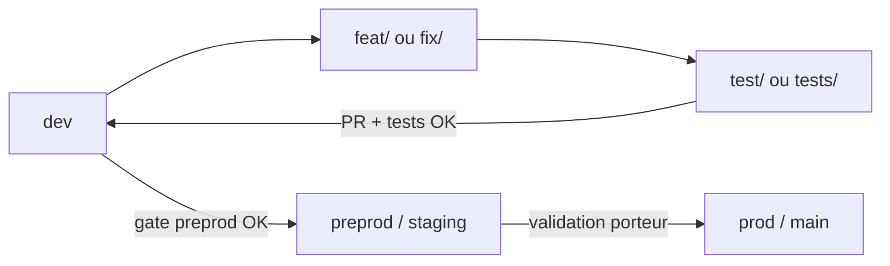

# Branches et commits

Date de creation : 13 mai 2026

## Objectif

Eviter les branches et commits ambigus. Une branche doit annoncer le type de travail. Un commit doit pouvoir etre compris seul dans l'historique.

## Nommage des branches

Format recommande :

```text
<type>/<sujet-court-kebab-case>
```

Types autorises (Conventional Branch — preferer `feature/` ou alias court `feat/`) :

- `feature/` ou `feat/` : nouvelle fonctionnalite.
- `bugfix/` ou `fix/` : correction de bug ou regression non critique.
- `hotfix/` : correction urgente en production.
- `release/` : preparation de version (ex. `release/v1.4.0`).
- `docs/` ou `doc/` : documentation, audit, plan, rapport.
- `chore/` : maintenance repository, scripts non fonctionnels, hygiene.
- `test/` : tests uniquement.
- `refactor/` : refactor sans changement fonctionnel attendu.
- `perf/` : optimisation de performance.
- `style/` : formatage, lint, conventions de code.
- `ci/` : pipelines CI/CD, workflows GitHub Actions.
- `design/` : UI/UX, maquettes visuelles.
- `security/` : changement securite important ou campagne audit dediee.

Format recommande (ticket optionnel) :

```text
<type>/<ticket-id-optionnel>-<sujet-court-kebab-case>
```

Exemples :

- `feature/bl26-user-authentication`
- `bugfix/gateway-rate-limit-headers`
- `hotfix/sec-001-patch-login-bypass`
- `docs/monitoring-security-audit`
- `fix/admin-login-env-password`
- `feat/security-alert-email-ui`
- `chore/reports-artifact-cleanup`
- `test/backend-service-centralization`

## Branches principales

- `main` : code stable deploye en production.
- `dev` : integration continue ; toutes les features passent par PR/merge ici.
- `release/*` : stabilisation avant merge vers `main`.
- `hotfix/*` : correctifs prod merges dans `main` **et** `dev`.

Regle : ne jamais committer directement sur `main` ou `dev` ; toujours une branche prefixee puis PR.

## Branches terminees (archive GitHub)

Quand une branche de travail est deja integree dans `dev` mais doit rester visible sur GitHub pour historique, la renommer avec le prefixe :

```text
finish-<type>/<sujet-court-kebab-case>
```

Exemples :

- `finish-docs/monitoring-security-audit`
- `finish-fix/admin-login-env-password`
- `finish-feat/security-alert-email-ui`

Ne pas appliquer ce prefixe aux branches de ligne de vie (`dev`, `main`, `prod`, `preprod`, `production`, `staging`) ni aux branches encore ouvertes.

## Commits

Format :

```text
<type>(scope optionnel): message court
```

Types autorises :

- `feat:` nouvelle fonctionnalite.
- `fix:` correction.
- `docs:` documentation uniquement.
- `chore:` maintenance sans changement produit direct.
- `test:` ajout ou correction de tests.
- `refactor:` refactor sans changement fonctionnel.
- `perf:` optimisation de performance.
- `style:` formatage, lint, CSS.
- `ci:` pipelines CI/CD.
- `build:` scripts de build ou export.
- `revert:` annulation d'un commit precedemment merge.
- `misc:` changement transversal difficile a classer, a eviter si un type plus precis existe.

Scopes utiles :

- `docs`
- `monitoring`
- `security`
- `ci`
- `auth`
- `reports`
- `tests`
- `structure`
- `frontend`
- `backend`

Exemples :

- `docs(monitoring): clarify Rust migration and C legacy status`
- `docs(security): add project audit and validation register`
- `chore(reports): stop tracking generated artifacts`
- `fix(auth): secure admin credential setup`
- `test: organize scripts and test assets`

## Regles avant commit

1. Verifier `git status`.
2. Ne pas melanger des sujets sans lien direct.
3. Ne pas committer `.env`, secrets, rapports generes sensibles ou artefacts volumineux.
4. Executer une validation adaptee sans commande `make` directe si l'agent travaille dans Cursor.
5. Si un commit est uniquement documentation, utiliser `docs:`.
6. Si un changement touche code + docs pour la meme correction, choisir le type du changement principal.

## Workflows GitHub

Certains workflows se declenchent selon les chemins modifies, les branches ou les evenements GitHub. Il est normal qu'un commit de documentation ne declenche pas exactement les memes jobs qu'un commit CI/backend/frontend.

Action a faire : documenter dans `docs/ci-cd/README.md` la matrice exacte des triggers par workflow.

## Integration sur `dev`

Ordre conseille pour remettre le travail sur la branche principale de developpement :

1. Terminer la correction sur une branche prefixee (`fix/...`, `feat/...`, `docs/...`, etc.), pousser, ouvrir une PR vers **`dev`** (ou merger localement apres rebase sur `dev` si vous travaillez seul).
2. Une branche secondaire (ex. `docs/security-p0-triage`, `fix/dev-https-api-centralization`) se merge dans **`dev`** quand le sujet est clos ; eviter de melanger deux chantiers sans lien sur la meme branche (voir regles de commits ci-dessus).
3. Apres merge, supprimer la branche distante si elle ne sert plus, ou la renommer en `finish-<type>/...` si elle doit rester consultable comme archive de travail ; tirer ensuite `dev` a jour sur les postes de travail.

Les noms de branches historiques ou experimentaux ne remplacent pas ce schema : tout finit sur **`dev`** par merge ou PR, sauf politique equipe differente documentee ailleurs.

## Flux de travail complet (feat / fix → tests → dev → preprod)

Schema recommande pour enchainer les chantiers sans melanger validation et developpement :



### Etapes detaillees

1. **Partir de `dev` a jour**
   ```bash
   git checkout dev && git pull origin dev
   ```

2. **Ouvrir une branche de travail** (`feat/`, `fix/`, `docs/`, etc.)
   ```bash
   git checkout -b feat/mon-sujet
   ```
   Commits atomiques ; message `type(scope): ...` (voir section Commits).

3. **Branche de validation tests** (quand le sujet est pret a etre verifie)
   - Creer depuis la branche de travail ou depuis `dev` apres rebase :
     ```bash
     git checkout -b test/mon-sujet
     ```
   - Lancer la batterie adaptee (smokes mobile, tests backend, gate frontend, etc.).
   - Documenter les preuves dans **`docs/pilotage/TODOS_A_VERIFIER.md`**.
   - Ne pas merger dans `dev` tant que les tests cibles et la non-regression exigee ne sont pas verts.

4. **Integration dans `dev`**
   - PR `test/mon-sujet` → `dev` (ou `feat/mon-sujet` → `dev` si la branche test n'a servi qu'a une passe courte).
   - Apres merge : tirer `dev`, renommer la branche en `finish-<type>/...` si archive utile, supprimer les branches locales/obsoletes.

5. **Preprod / production**
   - Gates porteur : **`docs/production/A_VALIDER_AVANT_PRODUCTION.md`**, **`DEPLOIEMENT_PRODUCTION.md`**, **`VALIDATION_PRODUCTION.md`**.
   - Merge `dev` → branche preprod/staging uniquement apres validations ouvertes fermees dans **`docs/pilotage/TODOS_A_VALIDER.md`**.

### Quand utiliser `test/` vs travailler directement sur `feat/`

| Situation | Branche |
|-----------|---------|
| Correction ou feature en cours, commits frequents | `feat/` ou `fix/` |
| Campagne de tests / non-regression avant merge `dev` | `test/` ou `tests/` (meme convention kebab-case) |
| Documentation ou pilotage seul | `docs/` |
| Maintenance repo sans impact produit | `chore/` |

Les prefixes `test/` et `tests/` sont equivalents ; preferer **`test/`** pour rester aligne avec le type autorise ci-dessus.

### Enchainement depuis `dev`

Apres merge d'un sujet, le prochain chantier repart toujours de **`dev`** (pull, nouvelle branche `feat/` ou `fix/`). Ne pas empiler deux sujets non lies sur la meme branche de travail.

## Branche `maint/monitoring-c-legacy`

Branche de **maintenance longue duree** pour environnements qui restent sur le monitoring **C (legacy)** :

- `monitoring-agent` / `log-collector` en C
- **sans** migration Rust (`monitoring-agent-rs`, `log-collector-rs`, `rust/crates/metrics-aggregator`)

**Branche de travail courante (`dev`)** : monitoring **Rust** par defaut (profil `monitoring` Compose).

### Regles de synchronisation

1. Creer / mettre a jour depuis `dev` : `git checkout maint/monitoring-c-legacy && git merge dev`
2. **Conserver** les fichiers Compose / Makefile / docs qui pointent vers le monitoring C (ne pas merger aveuglément la bascule Rust).
3. En cas de conflit sur `docker-compose.yml`, `docker-compose.monitoring.yml`, profils Makefile monitoring : **garder la variante C** sur cette branche.
4. Ne pas supprimer le code Rust du depot : il reste present mais **desactive** via profils / variables sur cette branche.

Usage : deploiements ou postes qui n'ont pas encore valide la migration Rust ; CI dediee possible plus tard.
