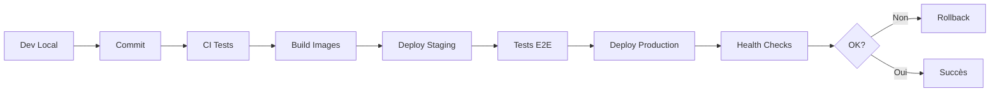

# 🚀 Scripts de Déploiement - JobbingTrack

[← Scripts](../README.md) | [← Documentation](../../README.md) | [← README principal](../../../README.md) | [🧭 Navigation](../../navigation.md)

Documentation des scripts pour le déploiement automatisé de JobbingTrack sur différentes plateformes.

## 🎯 Vue d'ensemble

Collection de scripts shell et Node.js pour automatiser le déploiement de JobbingTrack en développement, staging et production.

## 📋 Scripts Disponibles

### 🐳 Déploiement Docker

**Localisation**: `scripts/deployment/`

#### deploy-dev.sh
Déploiement environnement de développement local.

```bash
./scripts/deployment/deploy-dev.sh

# Options
-f, --force         Force rebuild des images
-d, --detach        Mode détaché
-v, --verbose       Mode verbose
```

**Actions**:
- Vérifie prérequis (Docker, docker-compose)
- Build images Docker
- Lance docker-compose
- Initialise base de données
- Configure variables environnement
- Execute health checks

#### deploy-prod.sh
Déploiement environnement de production.

```bash
./scripts/deployment/deploy-prod.sh

# Options
-e, --env ENV_FILE  Fichier environnement (.env.production)
-b, --backup        Backup avant déploiement
-r, --rollback      Point de rollback
```

**Actions**:
- Backup système complet
- Pull dernières images
- Migration base de données
- Déploiement zero-downtime
- Validation post-déploiement
- Rollback automatique si échec

#### deploy-staging.sh
Déploiement environnement de staging/pré-production.

```bash
./scripts/deployment/deploy-staging.sh
```

### ☁️ Déploiement Cloud

#### deploy-aws.sh
Déploiement sur AWS (ECS/Fargate).

```bash
./scripts/deployment/cloud/deploy-aws.sh

# Variables requises
export AWS_REGION=eu-west-1
export AWS_ACCOUNT_ID=123456789
export ECR_REPOSITORY=jobbingtrack
```

**Actions**:
- Build et push images ECR
- Update task definitions ECS
- Rolling update services
- Update Load Balancer
- CloudWatch logs configuration

#### deploy-azure.sh
Déploiement sur Azure Container Instances.

```bash
./scripts/deployment/cloud/deploy-azure.sh

# Variables requises
export AZURE_RESOURCE_GROUP=jobbingtrack-rg
export AZURE_LOCATION=westeurope
export ACR_NAME=jobbingtrackacr
```

#### deploy-gcp.sh
Déploiement sur Google Cloud Platform (Cloud Run).

```bash
./scripts/deployment/cloud/deploy-gcp.sh

# Variables requises
export GCP_PROJECT_ID=jobbingtrack-prod
export GCP_REGION=europe-west1
export GCR_HOSTNAME=gcr.io
```

### 🎨 Portainer

#### portainer-deploy.sh
Déploiement via interface Portainer.

```bash
./scripts/deployment/portainer-deploy.sh

# Options
-u, --url URL       URL Portainer
-t, --token TOKEN   Token API
-s, --stack NAME    Nom du stack
```

**Fonctionnalités**:
- Déploiement stack via API Portainer
- Configuration variables environnement
- Gestion volumes et réseaux
- Monitoring via UI Portainer

Voir [Guide Portainer](../../deployment/portainer/README.md) pour plus de détails.

### 🔄 Déploiement Continu (CI/CD)

#### ci-deploy.sh
Script pour pipelines CI/CD (GitHub Actions, GitLab CI).

```bash
./scripts/deployment/ci-deploy.sh

# Utilisation dans GitHub Actions
- name: Deploy
  run: ./scripts/deployment/ci-deploy.sh
  env:
    DEPLOY_ENV: production
    DOCKER_REGISTRY: ghcr.io
```

**Intégrations**:
- GitHub Actions
- GitLab CI/CD
- Jenkins
- CircleCI
- Travis CI

## 🛠️ Configuration

### Variables d'Environnement

#### Développement (.env.development)
```bash
NODE_ENV=development
API_URL=http://localhost:3000
DATABASE_URL=postgresql://localhost:5432/jobbingtrack_dev
REDIS_URL=redis://localhost:6379
LOG_LEVEL=debug
```

#### Production (.env.production)
```bash
NODE_ENV=production
API_URL=https://api.jobbingtrack.com
DATABASE_URL=postgresql://prod-db:5432/jobbingtrack
REDIS_URL=redis://prod-redis:6379
LOG_LEVEL=info
ENABLE_METRICS=true
ENABLE_SENTRY=true
```

### docker-compose Overrides

#### docker-compose.dev.yml
Extensions pour développement.

```yaml
services:
  frontend:
    volumes:
      - ./frontend:/app
      - /app/node_modules
    command: npm run dev
    
  backend:
    volumes:
      - ./backend:/app
      - /app/node_modules
    command: npm run dev:watch
```

#### docker-compose.prod.yml
Configuration production.

```yaml
services:
  frontend:
    restart: always
    environment:
      - NODE_ENV=production
    healthcheck:
      test: ["CMD", "curl", "-f", "http://localhost:3000/health"]
      interval: 30s
      timeout: 10s
      retries: 3
```

## 🔐 Sécurité Déploiement

### Secrets Management

#### Utilisation Vault
```bash
# Récupérer secrets depuis Vault
export VAULT_ADDR=https://vault.example.com
export VAULT_TOKEN=xxxxx

./scripts/deployment/load-secrets-vault.sh
```

#### AWS Secrets Manager
```bash
# Récupérer secrets depuis AWS
aws secretsmanager get-secret-value \
  --secret-id jobbingtrack/prod \
  --query SecretString \
  --output text > .env.production.secrets
```

### Authentification Registries

```bash
# Docker Hub
docker login -u username -p password

# GitHub Container Registry
echo $GITHUB_TOKEN | docker login ghcr.io -u username --password-stdin

# AWS ECR
aws ecr get-login-password --region eu-west-1 | \
  docker login --username AWS --password-stdin 123456789.dkr.ecr.eu-west-1.amazonaws.com
```

## 📊 Monitoring Déploiement

### Health Checks

```bash
# Vérification post-déploiement
./scripts/deployment/health-check.sh

# Tests
- API Gateway: http://localhost:3000/health
- Services backend: Vérification individuelle
- Base de données: Connexion et migrations
- Frontend: Rendu page
```

### Rollback

```bash
# Rollback automatique si erreur
./scripts/deployment/rollback.sh

# Rollback vers version spécifique
./scripts/deployment/rollback.sh --version v1.2.3

# Liste versions disponibles
./scripts/deployment/list-versions.sh
```

### Logs

```bash
# Logs déploiement
tail -f logs/deployment/deploy-$(date +%Y%m%d).log

# Logs services
docker-compose logs -f --tail=100

# Logs spécifique service
docker-compose logs -f frontend
```

## 🐛 Dépannage

### Déploiement échoue

```bash
# Mode debug
DEBUG=1 ./scripts/deployment/deploy-prod.sh

# Vérifier prérequis
./scripts/deployment/check-prerequisites.sh

# Nettoyer et réessayer
./scripts/deployment/cleanup.sh
./scripts/deployment/deploy-prod.sh --force
```

### Images Docker ne build pas

```bash
# Nettoyer cache Docker
docker system prune -af

# Rebuild sans cache
docker-compose build --no-cache

# Vérifier Dockerfile
docker build --progress=plain -f Dockerfile .
```

### Services ne démarrent pas

```bash
# Vérifier logs
docker-compose logs --tail=50

# Vérifier configuration
docker-compose config

# Health check manuel
docker-compose ps
curl http://localhost:3000/health
```

## 📚 Ressources

- **[Guide Déploiement](../../deployment/getting-started/README.md)** - Guide complet
- **[Production](../../deployment/production/README.md)** - Configuration production
- **[Sécurité](../../deployment/security/README.md)** - Bonnes pratiques sécurité
- **[Portainer](../../deployment/portainer/README.md)** - Déploiement interface graphique
- **[Scripts](../README.md)** - Tous les scripts disponibles

## 🔄 Workflows Déploiement

### Développement → Production



### Commandes

```bash
# 1. Développement local
make up

# 2. Tests
make test-all

# 3. Build production
make build-prod

# 4. Deploy staging
./scripts/deployment/deploy-staging.sh

# 5. Tests staging
make test-staging

# 6. Deploy production
./scripts/deployment/deploy-prod.sh

# 7. Monitoring
make health
```

---

**Version**: 4.1  
**Dernière mise à jour**: Octobre 2025
